# safeMPPI demo in 3D

## 2026-08-01 handoff — HP100 cylinder pretraining, sphere OOD, and Stage 1

This is the current handoff for Minhyuk's unchanged native `deploy_sim`
workflow. It is built on the independently pushed trajectory-following commit
`5bcd05d197eb46ef9282c12b83291ae19a2ea928`; this integration does not alter
any file under [`deploy_sim/`](deploy_sim/). The complete handoff, checkpoint,
hashes, reproducible trajectory archives, and exact commands are in
[`flow_deployment/minhyuk_stage1_handoff/`](flow_deployment/minhyuk_stage1_handoff/).

| deliverable | authoritative location |
|---|---|
| cylinder-ID distribution, 4–8 vertical cylinders | [`lab_clutter_cylinders_path_midpoint_uniform_v2.json`](configs/lab_clutter_cylinders_path_midpoint_uniform_v2.json) |
| physical-lab evidence, exactly 6 vertical cylinders | [`lab_clutter_cylinders_lab_six_v2.json`](configs/lab_clutter_cylinders_lab_six_v2.json) |
| sphere-OOD distribution, 3–6 spheres | [`lab_clutter_spheres_path_midpoint_uniform_v2.json`](configs/lab_clutter_spheres_path_midpoint_uniform_v2.json) |
| fixed three-sphere OOD screen | [`lab_clutter_spheres_stage2_three_v2.json`](configs/lab_clutter_spheres_stage2_three_v2.json) |
| today's fixed midpoint-sphere expansion task | [`lab_ball_stage1_t128.json`](configs/lab_ball_stage1_t128.json) |
| pretrained cylinder-ID policy | [`hp100_t128_d3.pt`](flow_deployment/minhyuk_stage1_handoff/checkpoints/hp100_t128_d3.pt), SHA-256 `cc87b65f...e28ff` |

The first figure is one exact-six-cylinder SafeMPPI scene matching the physical
lab inventory. The left panel is perspective and the right panel is an upper
view. All four gamma trajectories use the same scene and rollout seed and are
genuine successes: conservative gamma `0.1` makes the large detour, while
gamma `1.0` is goal-directed. This is qualitative evidence, not a rate estimate.

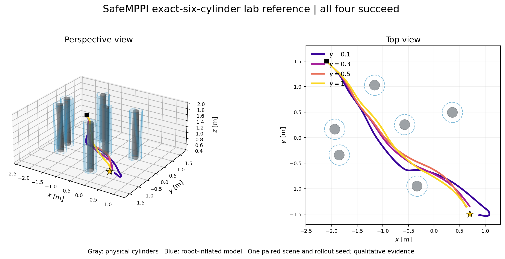

The four per-gamma animations replay the stored evolving nominal polytope and
its ten horizon level sets: [gamma 0.1](flow_deployment/minhyuk_stage1_handoff/assets/cylinder_id_safemppi_nominal_g0p1.gif),
[gamma 0.3](flow_deployment/minhyuk_stage1_handoff/assets/cylinder_id_safemppi_nominal_g0p3.gif),
[gamma 0.5](flow_deployment/minhyuk_stage1_handoff/assets/cylinder_id_safemppi_nominal_g0p5.gif), and
[gamma 1.0](flow_deployment/minhyuk_stage1_handoff/assets/cylinder_id_safemppi_nominal_g1p0.gif).

The second figure is the honest fixed single-sphere round-zero screen of the
pretrained policy: raw temperature-one sampling on the same
(M=20/\gamma) seed bank. Red crosses mark failures. Its pooled baseline is SR
`13.75%`, CR `80.00%`, and OOB `6.25%`;
the mostly in-plane, low-coverage behavior is the declared starting point for
Stage 1 expansion, not a successful deployment claim. This evaluation uses no
uncertainty tilt, no verifier controller, and no fallback.

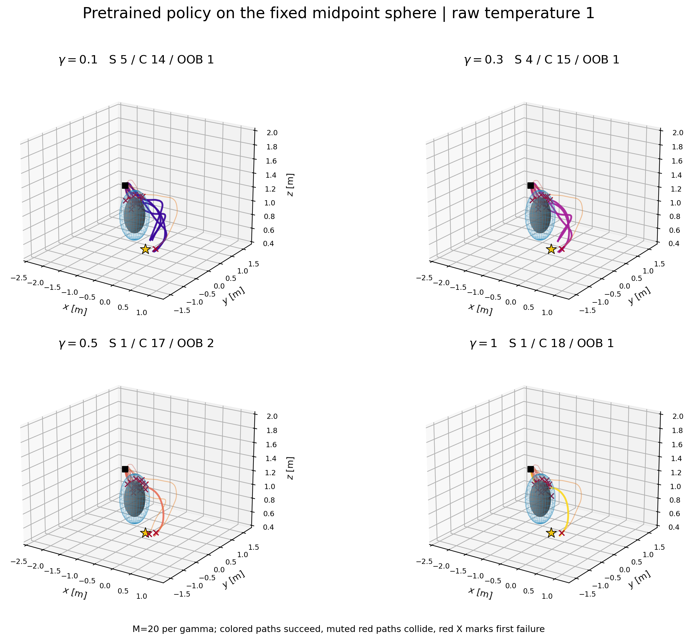

Today Stage 1 uses that fixed sphere with
[`run_ball_expansion.py`](scripts/run_ball_expansion.py) and
[`evaluate_ball_expansion.py`](scripts/evaluate_ball_expansion.py). An expanded
checkpoint will be handed over only after raw metrics and route coverage are
qualified. The randomized three-sphere failure screen is already packaged as
an additional handoff asset, while full randomized-sphere expansion remains
Stage 2.

A small, standalone reference for collecting 3D SafeMPPI rollouts from a point-mass double
integrator. The package exposes the taskspace and controller recipe in one JSON file, runs the full
gamma grid, records every actual rollout, reports safety/performance metrics, and renders the BLUE
nominal polytope with its ten horizon level sets.

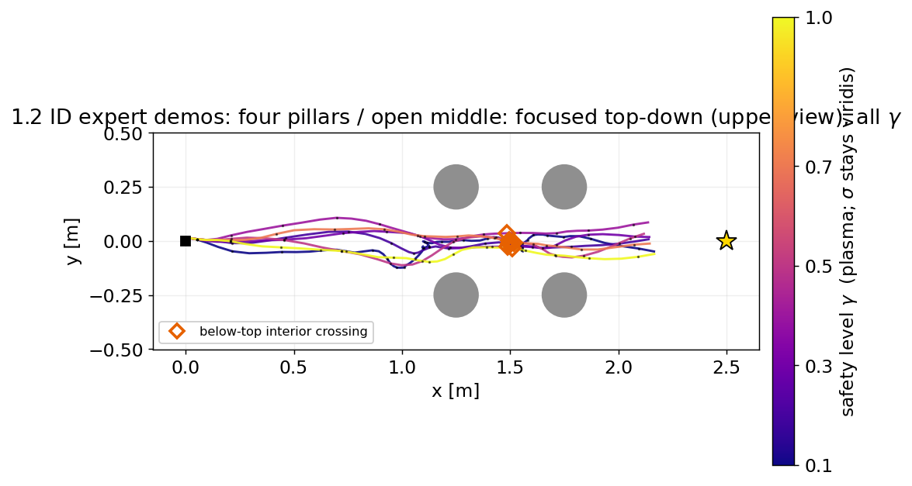

This repository intentionally contains one sampling implementation:
`mode1_centroid_anisotropic`. It does not hide alternate sampling modes behind configuration flags.

## Project status

| stage | status | where |
|---|---|---|
| Define taskspace, start/goal, obstacles, and double-integrator dynamics | implemented | [`default_config.json`](default_config.json), [`environment.py`](safe_mppi/environment.py) |
| Define the current mode-1 SafeMPPI recipe | implemented | [`controller.py`](safe_mppi/controller.py) |
| Acquire data for every gamma, compute metrics, and render figures | implemented | [`acquire.py`](safe_mppi/acquire.py), [`visualize.py`](safe_mppi/visualize.py) |
| Task-agnostic B1 Safe Flow Expansion core | implemented | [`expansion.py`](safe_mppi/expansion.py), [`flow_model.py`](safe_mppi/flow_model.py) |
| Expansion result/gallery/video skeletons | implemented | [`expansion_visualize.py`](safe_mppi/expansion_visualize.py) |
| Frozen flow policy → unchanged offline deployment loop | diagnostic bridge | [`flow_deployment/`](flow_deployment/) |
| Lab-native pretrained flow → online/frozen handoff | implemented | [`flow_deployment/minhyuk_handoff/`](flow_deployment/minhyuk_handoff/) |
| Random-cylinder pretraining → random-sphere expansion handoff | experimental | [`flow_deployment/minhyuk_clutter_handoff/`](flow_deployment/minhyuk_clutter_handoff/) |

The expansion core is deliberately separated from task facts. A new 3D task must provide its own
context, dynamics, nominal `H_P` gate, full-H verifier, and execution cost through the documented
adapter. The core does not pretend that the current nominal-polytope controller is a full verifier.

## Quick start

Python 3.10 or newer is required.

```bash
python -m venv .venv
source .venv/bin/activate
python -m pip install -r requirements.txt
python run.py --config default_config.json --output outputs/default_run --device cpu

# Requested biased 20-inch-ball demonstrations (8 paired seeds x 4 gammas)
python run.py --config configs/ball_biased_demo.json \
  --output outputs/ball_biased_demo --device cpu
```

CUDA is optional. To use physical GPU 2 while keeping the process-local device name unambiguous:

```bash
CUDA_VISIBLE_DEVICES=2 python run.py \
  --config default_config.json \
  --output outputs/default_run \
  --device cuda:0
```

The run produces one NPZ file per episode, `manifest.json`, `metrics.csv`, `metrics.json`, a 3D
gamma-colored rollout overlay, and a BLUE nominal-level-set figure.

## Experiment 1 — lab-frame SafeMPPI and trajectory tracking

[`configs/experiment1_lab_ball.json`](configs/experiment1_lab_ball.json) is the
canonical quick handoff to the deployment team. It gathers one accepted
SafeMPPI reference for each gamma and carries the external setpoint-tracking
settings in the same file.

| major element | Experiment 1 |
|---|---|
| start / goal | `(-2.1,1.5,.9)` / `(.7,-1.5,.9)` m |
| obstacle | sphere at `(-.7,0,.9)` m, radius `.379 m` |
| gamma | `.1,.3,.5,1`, one accepted reference each |
| nominal polytope | 80 faces, 2 m sensing, `H=10` |
| proposal geometry | centroid steering off; anisotropic sampling off |
| lower-route bias | `.75 exp((z-.9)/.08)` |
| reference limits | `.3 m/s²`, `.7 m/s`, `.3 m/s` vertical |
| setpoint follower | \(p_{\rm cmd}=.85p_{\rm measured}+.15p_{\rm stored}\) |
| generative policy | completed raw-command `raw10` checkpoint; see `flow_deployment/minhyuk_handoff/` |

```bash
# 1. Raw SafeMPPI simulation: one accepted reference and nominal-polytope
#    visualization per gamma.
python run.py \
  --config configs/experiment1_lab_ball.json \
  --output results/lab_ball_pretrain/experiment1_one_per_gamma_s0 \
  --device cpu

python scripts/visualize_lab_ball_demos.py \
  --demo-dir results/lab_ball_pretrain/experiment1_one_per_gamma_s0 \
  --output-dir results/lab_ball_pretrain/experiment1_one_per_gamma_s0/qualification

# 2. Fly them, or run the same loop offline first.
#    See crazyflie_sim/hardware (lab-local) or deploy_sim/run_offline.py.
```

The four accepted SafeMPPI references all reach the goal without collision.
Their minimum clearances are `.182/.088/.047/.005 m` for gamma `.1/.3/.5/1`.

### Hardware result (2026-07-26)

Live SafeMPPI — replanning every 100 ms from the measured Vicon position, not
replaying a stored reference — was flown at all four gammas on a Crazyflie 2.1.
**All four reached the goal, none aborted, none touched the obstacle**, with
`+.215/.094/.162/.066 m` between the drone shell and the ball surface.

The measured position tracked the controller's own predicted reference to
**27-31 mm RMSE** (52 mm worst case), consistent across every gamma. The control
loop held its 100 ms period to within `+0.5%` with zero overruns in 343 cycles.

This retired the calibrated deployment plant. That plant had been fitted to a
flight recorded before a control-loop timing bug was fixed, and afterwards
predicted 176-242 mm of tracking error where the vehicle showed 27-31 mm --
5.7-8.2x pessimistic. It wrongly predicted that gamma `.5` and `1` would strike
the obstacle. `deploy_sim/plant.py` and `safe_mppi/lab_plant_replay.py` were
removed on 2026-07-26; `deploy_sim/vehicle.py` replaces them and has no fitted
parameters. See [`deploy_sim/README.md`](deploy_sim/README.md).

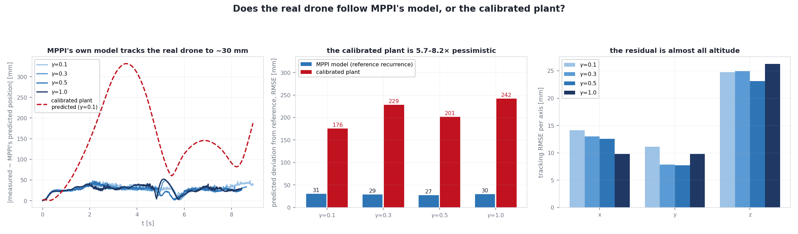

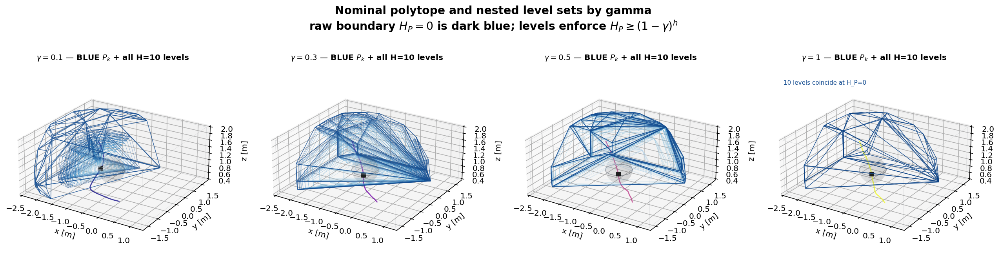

The files the deployment team should inspect are:

| role | authoritative code |
|---|---|
| Experiment 1 values | [`configs/experiment1_lab_ball.json`](configs/experiment1_lab_ball.json) |
| nominal-polytope SafeMPPI | [`safe_mppi/controller.py`](safe_mppi/controller.py) |
| once-only acceleration/velocity governor | [`safe_mppi/environment.py`](safe_mppi/environment.py) |
| collection and accepted-reference archive | [`safe_mppi/acquire.py`](safe_mppi/acquire.py) |
| nominal-polytope visualization | [`safe_mppi/visualize.py`](safe_mppi/visualize.py) |
| offline deployment vehicle | [`deploy_sim/vehicle.py`](deploy_sim/vehicle.py) |
| frozen-reference schema | [`flow_deployment/lab_reference_contract.py`](flow_deployment/lab_reference_contract.py) |
| pretrained policy handoff | [`flow_deployment/minhyuk_handoff/`](flow_deployment/minhyuk_handoff/) |
| lab Safe Flow Expansion adapter | [`safe_mppi/lab_flow_expansion.py`](safe_mppi/lab_flow_expansion.py) |
| lab raw temperature-1 evaluator | [`safe_mppi/lab_flow_evaluation.py`](safe_mppi/lab_flow_evaluation.py) |
| online deployment runner | [`scripts/run_lab_flow_deployment.py`](scripts/run_lab_flow_deployment.py) |
| frozen trajectory exporter | [`scripts/export_lab_flow_frozen_references.py`](scripts/export_lab_flow_frozen_references.py) |

The current lab-native visual checkpoint predicts raw `H=10` accelerations
from \([g-p,v,\gamma]\) plus a robot-centered
\(3\times16\times12\times12\) occupancy/nominal-polytope/\(H_P\) grid. It
applies no internal governor. Online deployment rebuilds the visual context
from the current measured position and known configured map at every replan;
frozen export applies `ReferenceGovernor` exactly once and writes
`dense_positions`, governed `executed_controls`, and raw `controls`. The
visual map input is not an onboard-perception claim, and neither checkpoint is
a flight-safety guarantee.

### Randomized clutter transfer

The clutter pipeline keeps the same lab geofence and fixed start/goal, but
removes the single-ball lower-route bias:

| stage | obstacle distribution | learned input |
|---|---|---|
| SafeMPPI demonstrations | three randomized vertical cylinders, physical diameter `.20 m` | 3-D visual safety volume |
| OOD expansion/evaluation | three randomized spheres, effective radius `.379 m` | the same visual safety volume |

The point-mass hard radii consistently include the `.125 m` vehicle shell:
`.225 m` for each cylinder and `.379 m` for each sphere. Both distributions
require `.20 m` between inflated surfaces, `.10 m` from
the taskspace wall, and `.50 m` from the fixed start and goal. Cylinder
geometry is `[x,y,r]`, hence full-height and vertical; finite or tilted
cylinders are not represented by this package. The same deterministic
cylinder scene bank is used for every gamma, and train/validation splits are
disjoint by scene hash rather than by individual trajectory. Obstacle centers
are otherwise uniform over the admissible taskspace: centerline proximity is
logged as a diagnostic and is never used to retain or reject a scene. Because
a demonstration archive cannot contain an unsolved expert rollout, uniform
layout proposals are admitted only when SafeMPPI finds one accepted trajectory
for every configured gamma within the finite retry budget. Rejected candidates,
attempts, and the resulting conditional-distribution contract are retained in
the manifest.

```bash
# 50 randomized scenes x 4 gammas, accepted SafeMPPI trajectories only.
python scripts/collect_lab_clutter_demos.py \
  --config configs/lab_clutter_cylinders_pretrain.json \
  --output results/lab_clutter_cylinders/demos_50pg_effective_s0

python scripts/visualize_lab_clutter_demos.py \
  --demo-dir results/lab_clutter_cylinders/demos_50pg_effective_s0 \
  --output results/lab_clutter_cylinders/demos_50pg_effective_s0/paired_gamma_scene_overlay.png

# Visual policy: [goal-position, velocity, gamma] plus the robot-centered
# 3 x 16 x 12 x 12 occupancy/polytope/H_P volume.
python scripts/pretrain_lab_reference_flow.py \
  --demo-dir results/lab_clutter_cylinders/demos_50pg_effective_s0 \
  --output results/lab_clutter_cylinders/pretrain_visual_hp3d_effective_h48p32_s0 \
  --context-model visual_hp3d --device mps

# OOD sphere expansion. Exact sphere coordinates are verifier-only metadata;
# the policy still receives only its visual context.
python scripts/run_ball_expansion.py \
  --pretrain-dir results/lab_clutter_cylinders/pretrain_visual_hp3d_effective_h48p32_s0 \
  --lab-task-config configs/lab_clutter_spheres_ood.json \
  --output results/lab_clutter_spheres/expansion_s0 \
  --rounds 50 \
  --flow-base-std 1.5 \
  --learning-rate 3e-5 \
  --first-layer-lr-scale 0.1 \
  --beta 5e-4 --adaptive-beta --ess-target 0.2 \
  --parallel-episodes 12 --verifier-workers 8 \
  --max-retry-batches 16 --successful-trajectories-per-gamma 3 \
  --K 16 --B 4 --inner-steps 10 --batch-size 64 \
  --replay-selector uniform --replay-rounds 3 \
  --gp-buffer-cap 768 \
  --gp-reference-mode sliding_success_per_gamma_current_phi \
  --gp-sliding-row-selector trajectory_uniform \
  --candidate-perturb-std 0 --negative-alpha 0 \
  --archive-rule successful_executed_windows \
  --successful-trajectory-selector lowest_episode_id \
  --replay-acceptance execution_eligible \
  --execution-rule min_cost \
  --acquisition-feature learned_phi \
  --tight-corridor --verifier-mode full_polytope \
  --event-log committed_success --seed 1

python scripts/evaluate_ball_expansion.py \
  --pretrain-dir results/lab_clutter_cylinders/pretrain_visual_hp3d_effective_h48p32_s0 \
  --expansion results/lab_clutter_spheres/expansion_s0 \
  --episodes 20 --stride 10 \
  --fixed-scene-rollouts 10 \
  --video-gamma 0.5 \
  --video-rounds 0 1 10 20 30 40 50
```

Every cylinder demo NPZ carries its exact obstacle arrays and scene SHA-256.
Every sphere expansion context carries the three spheres only in a
verifier-only suffix, so CPU verifier workers never depend on mutable
task-global scene state. `deploy_sim/` is not used or modified by this
training/expansion pipeline. The expansion command is the first explicit
clutter-transfer recipe, not a tuned claim: no height selector, z-bias,
fallback, or expert replay is used. RBF lengthscale calibration uses 50 plans
sampled from the pretrained policy, and raw evaluation is always
temperature-one and disjoint from expansion scene hashes. The
`successful_executed_windows` archive intentionally does not enable
`--paired-noised-representation`: one committed window joins first actions
selected at several replanning contexts and therefore has no single
authoritative flow-base noise. Its GP feature is the current-model
\(\phi_s(U,c)\), rebuilt each round.

The evaluator keeps two questions separate. `raw_eval.json` measures
temperature-one SR/CR/OOB/window validity on a disjoint randomized-sphere
scene bank. `fixed_scene_raw_eval.json` repeats independent temperature-one
rollouts in one preregistered three-sphere scene shared by all checkpoints.
Only the latter reports successful-path spread (mean pairwise RMS distance
after arc-length resampling); path distance across different randomized
scenes or different gamma conditions is deliberately undefined. The fixed
scene gallery is therefore a qualitative multimodality view, not a substitute
for randomized-domain metrics. `mechanism.mp4` and
`mechanism_multiview.{png,pdf}` use the actual event log: each committed
success is shown in its own randomized scene, together with \(K\) candidates,
the selected \(B\), verifier positives, the executed first step, and the exact
window starts admitted to Adam. Trajectories from different gathering scenes
are never overlaid as if they were modes of one conditional distribution.
`--event-log committed_success` changes only retained visualization evidence:
it keeps every terminal-success trace (including the authoritative committed
subset) and prunes failed/NVP traces after each round. Checkpoints, query/GP
archives, replay, and optimization are unchanged.

#### Path-focused variable-clutter v2

> Historical predecessor: this subsection records the earlier Gaussian-v2
> study. For the current HP100 handoff, use only the midpoint-uniform-v2
> configurations linked at the top of this README.

The additive v2 contract leaves the fixed-three experiment above reproducible,
but removes its expert-conditioned scene admission and concentrates geometry
near the fixed start-goal segment:

| stage | count | physical + vehicle radius | modeled radius |
|---|---:|---:|---:|
| cylinder demonstrations | \(N\sim\mathrm{Unif}\{4,\ldots,8\}\) | `.10 + .10 m` | `.20 m` |
| sphere OOD expansion/evaluation | \(N\sim\mathrm{Unif}\{3,\ldots,6\}\) | `.254 + .10 m` | `.354 m` |

Centers use
\[
c_i=s+\lambda_i(g-s)+E_\perp\delta_i,\qquad
\lambda_i\sim\mathcal U(.15,.85),\quad
\delta_i\sim\mathcal N(0,.20^2I),
\]
followed only by body containment, endpoint non-intersection, and modeled-body
non-overlap. Extra pairwise and wall gaps are both zero. The `.20 m`
transverse scale was selected in a same-seed, unconditioned 16-scene sanity
screen and confirmed on 32 scenes: it retained `109/128` SafeMPPI successes,
whereas `.40 m` retained `83/128`. Larger scales produced more lateral
side-changes but made the expert substantially less reliable; `.20 m` still
interacted with roughly three obstacles per successful rollout. This is a
configuration screen, not final inference.

The scene bank is materialized before any controller call. Expert failures
remain declared scene/gamma cells and are never replaced; only successful
trajectories enter behavior cloning. The variable sphere verifier suffix is
fixed-width:
\[
[\text{previous applied}_3,\text{previous raw}_3,N,
  \text{zero-padded spheres}_{6\times4}].
\]
The learned visual policy never receives these exact sphere coordinates.

```bash
python scripts/collect_path_focused_clutter_demos.py \
  --config configs/lab_clutter_cylinders_path_v2.json \
  --output results/path_v2/cylinder_demos_s0 \
  --scenes 100 --domain-seed 0 --rollout-seed-start 0

python scripts/pretrain_lab_reference_flow.py \
  --demo-dir results/path_v2/cylinder_demos_s0 \
  --output results/path_v2/pretrain_visual_s0 \
  --context-model visual_hp3d --device cuda \
  --epochs 500 --batch-size 32 --learning-rate 3e-4 \
  --audit-episodes 100 --audit-seed 91000 \
  --ood-config configs/lab_clutter_spheres_path_v2.json \
  --ood-audit-episodes 100 --ood-audit-seed 191000
```

Expansion accepts both `--execution-rule max_step_margin` and `min_cost`. For
the latter only, `--execution-clearance-exp-weight` adds
\[
w\,H^{-1}\sum_h
\exp\!\left((d_{\rm target}-d_h)/T\right)
\]
to the native execution-ranking cost; its default weight is zero, which
exactly restores the prior scorer. `--device cuda` is supported by pretraining,
expansion, and clutter evaluation. Evaluation reports temperature-one
randomized-domain metrics pooled, per gamma, per obstacle count, and per
\((\gamma,N)\), with deterministic one-standard-deviation Wilson/bootstrap
bands. `deploy_sim/` remains untouched.

#### Canonical 50-round clutter result

The authenticated run used 50 accepted randomized cylinder scenes per gamma
for pretraining, then 50 expansion rounds in randomized three-sphere scenes.
Every round committed exactly three successful trajectories per gamma (600
total). Among the preregistered positive checkpoints
`{1,10,20,30,40,50}`, round 10 maximized pooled SR on the disjoint randomized
temperature-one evaluation; window validity and earliest round were the fixed
tie-breakers. The fixed-scene result was not used to choose the checkpoint.

| checkpoint | pooled SR | CR | OOB | window validity | successful clearance |
|---|---:|---:|---:|---:|---:|
| pretrained r0 | .5875 | .1750 | .2375 | .9213 | .2267 m |
| selected r10 | **.6250** | .3125 | **.0625** | .9131 | .2772 m |
| final r50 | .5375 | .3500 | .1125 | .9130 | **.3520 m** |

This is a non-monotone experimental result, not a solved safety claim: r10
improves SR and OOB over r0 but raises collision rate, and r20 temporarily
collapses. On the preregistered fixed three-sphere scene, r10 reaches
`.60/1.00/.60/.70` SR for gamma `.1/.3/.5/1`; successful path spread is
`.212/.189/.167/.149 m`. The repeated raw rollouts visibly differ, but they
remain variations within a limited route family rather than evidence of four
categorical homotopies.

The portable pretrained and selected expanded checkpoints, exact known-map
configuration, hashes, deterministic successful seeds, deployment commands,
and evidence are in
[`flow_deployment/minhyuk_clutter_handoff/`](flow_deployment/minhyuk_clutter_handoff/).
See the
[`fixed-scene raw gallery`](flow_deployment/minhyuk_clutter_handoff/evidence/fixed_scene_raw_gallery.png),
[`mechanism video`](flow_deployment/minhyuk_clutter_handoff/evidence/mechanism.mp4),
and
[`randomized-domain curves`](flow_deployment/minhyuk_clutter_handoff/evidence/randomized_raw_curves.pdf).

### Full 50-per-gamma pretraining archive

[`configs/lab_ball_pretrain.json`](configs/lab_ball_pretrain.json) is the
lab-frame data contract for the next expansion task. It does not transform the
old `(0,0,2) -> (3,0,2)` policy. It regenerates SafeMPPI demonstrations directly
in the deployment coordinates while leaving every file under `deploy_sim/`
unchanged.

| item | fixed value |
|---|---:|
| taskspace / soft geofence | `x=[-2.5,1.3], y=[-1.7,1.8], z=[.4,2.0]` m |
| start / goal | `(-2.1,1.5,.9)` / `(.7,-1.5,.9)` m |
| sphere | midpoint `(-.7,0,.9)` m, radius `.379` m |
| gamma / accepted demos | `.1,.3,.5,1` / `50` per gamma |
| horizon / `dt` / samples | `10 / .1 s / 512` |
| MPPI temperature / Gaussian sigma | `.02 / (.5,.5,.5)` |
| raw command cap | `.3 m/s^2` per axis |
| centroid / anisotropic proposal | disabled / disabled |
| initial command | `(0,0,0) m/s^2` |
| running / terminal / control / smooth cost | `.25 / 80 / .05 / .35` |
| soft-clearance weight / target | `60 / .3 m` |
| progress weight | `2` |
| below-ball bias | `.75 exp((z-.9)/.08)` |
| outside-taskspace cost | `5 sum_i expm1(d_i/.05)` |

The lab collector applies the Minhyuk reference governor directly; it is not an
opt-in ablation for this task. The lab config fails closed unless the governor
constants and success-only acceptance contract match exactly. For raw SafeMPPI
command \(u_t^{raw}\),

```text
u_t = .4 u_t^raw + .6 u_{t-1}
repeat 10 times at dt=.01:
    v <- v + dt u_t
    v <- min(1, .7/||v||) v
    v_z <- clip(v_z, -.3, .3)
    p <- p + dt v
```

SafeMPPI predicts this governed reference motion while retaining Minhyuk's cost
on the raw sampled commands. The archive stores `controls` (raw commands, the
behavior-cloning target) and `executed_controls` (once-smoothed reference
accelerations) separately. A deployment harness must therefore smooth the
learned raw command exactly once.

Collection retries until it has 50 collision-free, in-bounds, goal-reaching
rollouts with nonnegative executed one-step nominal-polytope slack for every
gamma. The manifest separately retains every rejected attempt, so accepted
archive SR=1 is never presented as the planner's pre-retry SR.

```bash
python run.py \
  --config configs/lab_ball_pretrain.json \
  --output results/lab_ball_pretrain/native_governed_w075_50pg_s0 \
  --device cpu

python scripts/visualize_lab_ball_demos.py \
  --demo-dir results/lab_ball_pretrain/native_governed_w075_50pg_s0 \
  --output-dir results/lab_ball_pretrain/native_governed_w075_50pg_s0/qualification
```

The seed-0 archive required `85/90/120/153` attempts to obtain 50 accepted
rollouts at \(\gamma=.1/.3/.5/1\). These are the pre-retry diagnostics, not
metrics computed only on the accepted subset:

| gamma | attempt SR | attempt CR | crossing below \(z=.9\) | accepted clearance [m] | accepted time [s] |
|---:|---:|---:|---:|---:|---:|
| .1 | 1.000 | 0.000 | 1.000 | .159 | 8.05 |
| .3 | .800 | .200 | 1.000 | .061 | 7.68 |
| .5 | .483 | .517 | 1.000 | .037 | 7.66 |
| 1 | .327 | .654 | 1.000 | .029 | 7.53 |

The configured command/reference caps were met exactly in the archive:
maximum raw component acceleration `.30000001`, maximum reference speed
`.70000008`, and maximum vertical speed `.30000001` in float32 arithmetic.
Replaying every raw command through the governor reconstructs all 200 stored
state and dense-position arrays with zero error.

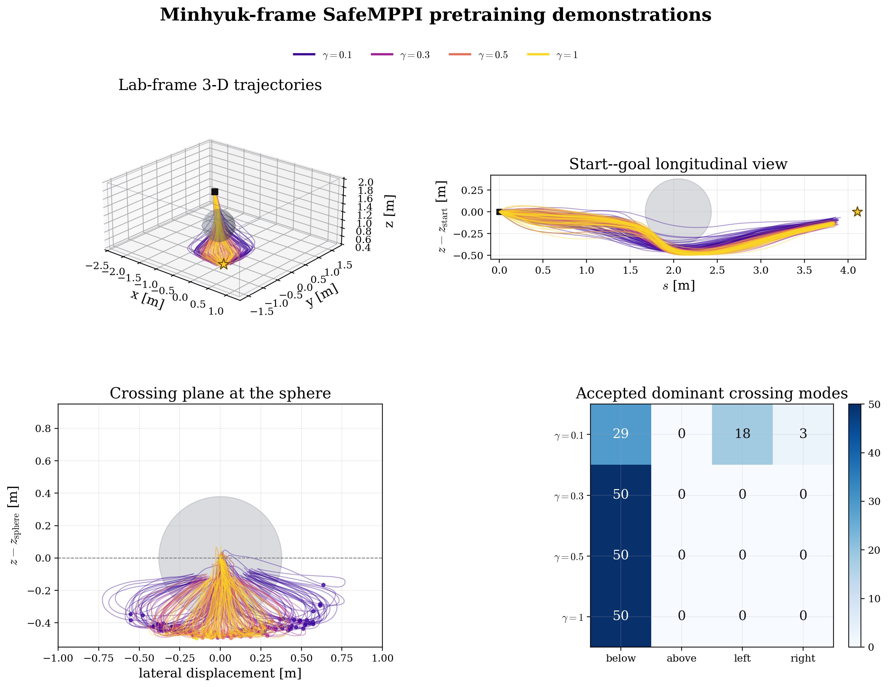

### Expanded r20 — independent multimodality screen

[`docs/EXPANDED_R20_MULTIMODALITY.md`](docs/EXPANDED_R20_MULTIMODALITY.md) is a
200-seed screen of `expanded_visual_nozB5_r20.pt` at fixed gamma `.3`, with five
seeds re-validated through a hardware control loop. Two findings worth carrying
forward: the below route is **absent, not rare** (deepest of 200 samples is `-.025 m`
relative to the obstacle centre, i.e. level flight), and the reachable
multimodality is a **78 cm lateral fan** at 1.05-1.55 m of climb. It also records a
33x control-budget trap from torch thread oversubscription on these small models.

### Reference-domain properties of the accepted archive

Every stored demonstration is a collision-free, in-bounds, goal-reaching
reference by construction. For all 200 accepted references the reference-domain
SR/CR is `100%/0%` at every gamma, with minimum clearances `.159/.061/.037/.029 m`
for gamma `.1/.3/.5/1`.

The "already clipped, therefore slow and easy to track" hypothesis does not hold
for the present cost. The raw `.3 m/s^2` component cap is active on
`81/65/61/60%` of 10 Hz steps, and the `.7 m/s` reference speed cap is active on
`17/29/31/33%` of 100 Hz points for gamma `.1/.3/.5/1`.

> **Removed 2026-07-26.** This section previously reported a replay of these
> references through a calibrated deployment plant, which showed `.244-.286 m`
> of tracking error and concluded that gamma `.3/.5/1` intersect the sphere.
> That plant was fitted to a flight recorded before a control-loop timing bug
> was fixed. On hardware, after the fix, live SafeMPPI tracked its own reference
> to `.027-.031 m` and **no gamma collided**. The plant was 5.7-8.2x pessimistic
> and its conclusions did not survive contact with the vehicle. The replay
> pipeline (`safe_mppi/lab_plant_replay.py`,
> `scripts/replay_lab_ball_references.py`) and the plant itself were deleted.
> High-gamma clearance is still the number to watch — but against measured
> tracking error, not a model's.

The attempt pool must not be confused with this accepted-reference replay.
Finite MPPI sampling occasionally makes all 512 H-step proposals infeasible;
the current controller then executes its explicitly coded least-bad fallback.
Those rejected attempts explain why obtaining the 50 accepted references took
`85/90/120/153` attempts across gamma. They do not enter the pretraining
archive, and they are not evidence that the nominal-polytope test itself passed
an unsafe sequence.

[`safe_mppi/lab_flow_task.py`](safe_mppi/lab_flow_task.py) is the only loader
for training a future lab-frame raw-command flow policy from this archive. It
uses a 13-D Markov context
\[
  c_t^{lab}=[c_t^{ball}\in\mathbb R^{10},
             u_{t-1}^{applied}\in\mathbb R^3]
\]
and keeps the H-step target as raw commands. The legacy 10-D
`pretrain_ball_flow.py` path is deliberately not wired to this archive because
it would silently replay governed states as if raw commands had been applied.

Two limitations are intentionally explicit. First, an all-full-H-infeasible
sample bank can still yield a one-step-admissible fallback; this is counted in
the attempt diagnostics and is not a full-H verifier guarantee. Second,
the committed lab expansion is a single-sphere experimental pipeline, not an
online flight-safety layer. The current expanded r20 checkpoint discovers an
above route but loses the pretrained below mode and reduces raw task success;
the exact audit and reproduction CLI are in
[`flow_deployment/minhyuk_handoff/`](flow_deployment/minhyuk_handoff/).
Multiple-ball policy conditioning is not implemented in this handoff.

A `deploy_sim` seed-0 smoke run is a stricter, separate check of the deployment
layer. Note that the earlier version of this paragraph reported gamma `.3/.5/1`
aborting into the sphere or fence; those aborts came from the calibrated plant
deleted on 2026-07-26 and were not reproduced on hardware, where all four gammas
flew clean. This archive is still controller/reference-domain pretraining data,
not a flight-safety certificate.

## Ball-below variant

[`ball_below_config.json`](ball_below_config.json) + [`docs/BALL_BELOW.md`](docs/BALL_BELOW.md)
define a second experiment: start `(0,0,2)` to goal `(3,0,2)` with a 20-inch ball at `(1.5,0,2)`,
an exponential altitude penalty `w exp((z-2)/T)` that keeps every rollout below the ball's
latitude-0 circle while the seed family fans out across passage angles, a `1 m/s^2`
demonstration cap, and a `[0.1,0,0]` warm-start bias. Analyze a finished run with
`python -m safe_mppi.ball_analysis --run <output_dir>` and render the animated rollouts with
`python -m safe_mppi.ball_gif --run <output_dir>`.

All ten seeds per gamma with the evolving translucent nominal polytope (camera orbits so the
level bands are seen from different angles); right panel is the head-on view from the start:

| gamma 0.1 | gamma 0.3 |
|---|---|
| 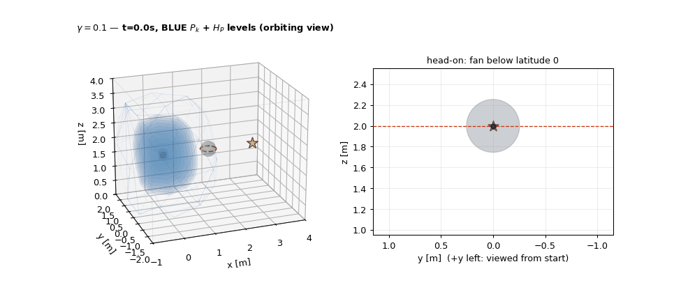 | 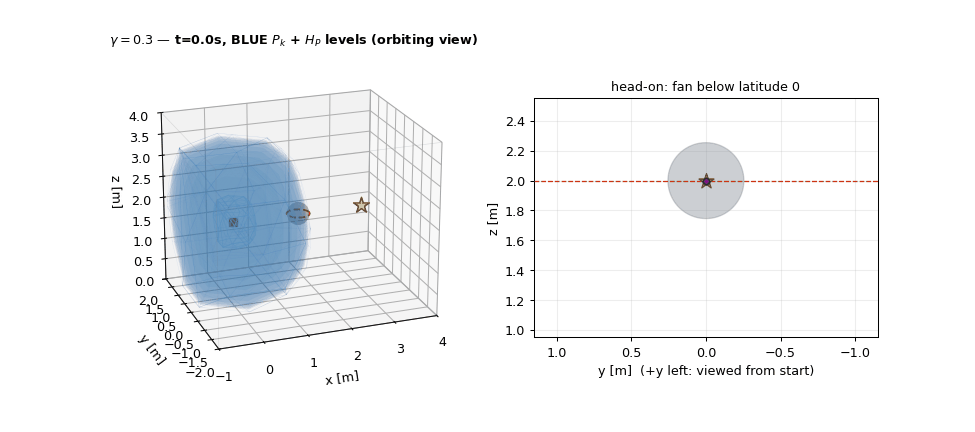 |

| gamma 0.5 | gamma 1.0 |
|---|---|
| 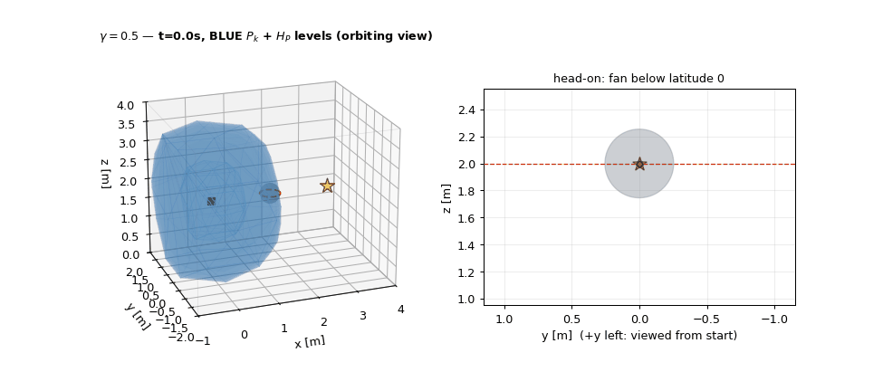 | 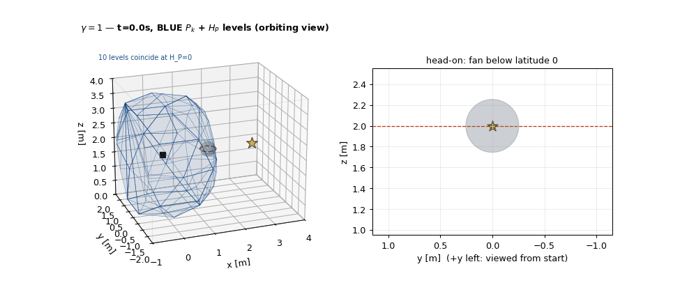 |

## Default experiment

All user-facing values live in [`default_config.json`](default_config.json).

| setting | default |
|---|---:|
| taskspace | `[0,5] x [0,5] x [0,3]` m |
| start | position `(0,0,2)` m, velocity `(0,0,0)` m/s |
| goal | `(5,5,2)` m |
| dynamics | 3D double integrator, `dt=0.1 s` |
| planning horizon | `H=10` |
| samples per control period | `512` |
| gamma grid | `.1,.2,.3,.4,.5,.7,1` |
| Gaussian sigma | `(1,1,1) m/s^2` |
| MPPI temperature | `0.1` |
| demonstration control cap | `1.2 m/s^2` per axis |
| platform authority, metadata only | `3.0 m/s^2` per axis |
| sensing range | `2.0 m` |
| nominal base | 80 triangular faces |
| smoothness weight | `0.12` |
| soft proximity preference | `25 relu(0.10-clearance)^2` |
| point-robot/hard obstacle/safety/gain/ZOH margins | all exactly `0` |
| paired episodes | one seed per gamma |

The default scene has no obstacles. It is a configuration and execution smoke test, not a safety
benchmark. Consequently, collision rate is zero and clearance is reported as `null`.

## Biased 20-inch-ball demonstration task

[`configs/ball_biased_demo.json`](configs/ball_biased_demo.json) is the small-data task requested for
the next expansion experiment. “20-inch ball” is interpreted explicitly as a 20-inch **diameter**:
the sphere radius is `0.254 m`.

| item | fixed value |
|---|---:|
| start / goal | `(0,0,2)` m / `(3,0,2)` m |
| sphere | center `(1.5,0,2)` m, radius `0.254 m` |
| gamma | `.1,.3,.5,1` |
| paired demonstration seeds | `0,...,7` for every gamma |
| demonstration acceleration cap | `1 m/s^2` per axis |
| initial warm action | `(0.1,0,0) m/s^2` |
| horizon / MPPI samples | `10 / 1536` |
| running / terminal / control / smoothness | `5 / 20 / .05 / .8` |
| proximity / progress auxiliary costs | `0 / 0` |
| lower-half bias | `.05 exp((z-2)/.012)` per predicted state |

Centroid steering is disabled (`centroid_gain=urgency_floor=0`, `sigma_aniso=1`). Thus the only
ranking terms are running state error, terminal state error, control effort/smoothness, and the
declared lower-half exponential bias. No proximity preference or hidden obstacle cost is used.

The checked-in eight-seed result is fully successful and collision-free. Near the ball
(`1.1 <= x <= 1.9`), every saved trajectory stays below the equatorial plane; the largest observed
`z` is `1.943 m`. Reproduce that predicate with `python scripts/audit_ball_demo.py`. The empirical
averages are:

| gamma | SR | CR | minimum clearance [m] | time-to-goal [s] | control variation | below-plane fraction |
|---:|---:|---:|---:|---:|---:|---:|
| .1 | 1.00 | 0 | .258 | 4.46 | .811 | .958 |
| .3 | 1.00 | 0 | .115 | 4.33 | .747 | .977 |
| .5 | 1.00 | 0 | .130 | 4.74 | .753 | .976 |
| 1 | 1.00 | 0 | .113 | 4.21 | .779 | .976 |

The strongest qualitative predictions hold: gamma `.1` keeps the largest clearance, gamma `1` is
fastest, and gamma `.5` has lower control variation than gamma `1`. Adjacent gamma averages are not
strictly monotone; the code does not add gamma-specific costs to manufacture that ordering.

| all paired rollouts | paired rollouts separated by gamma |
|---|---|
| 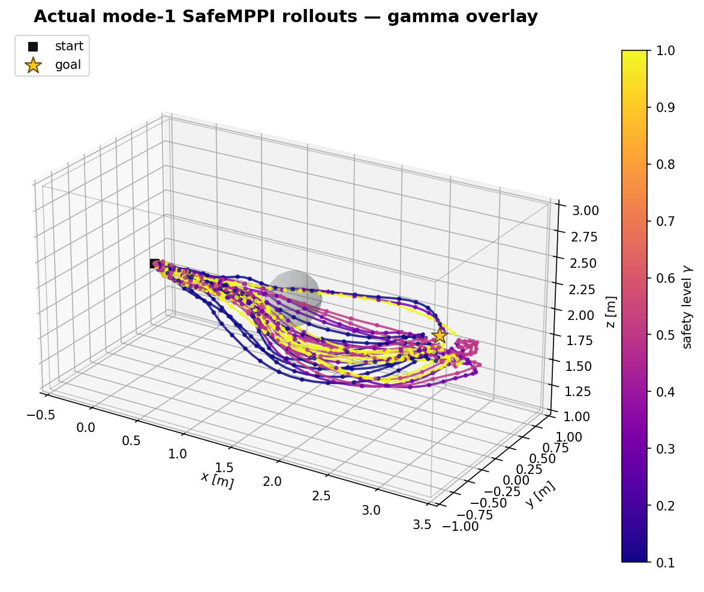 | 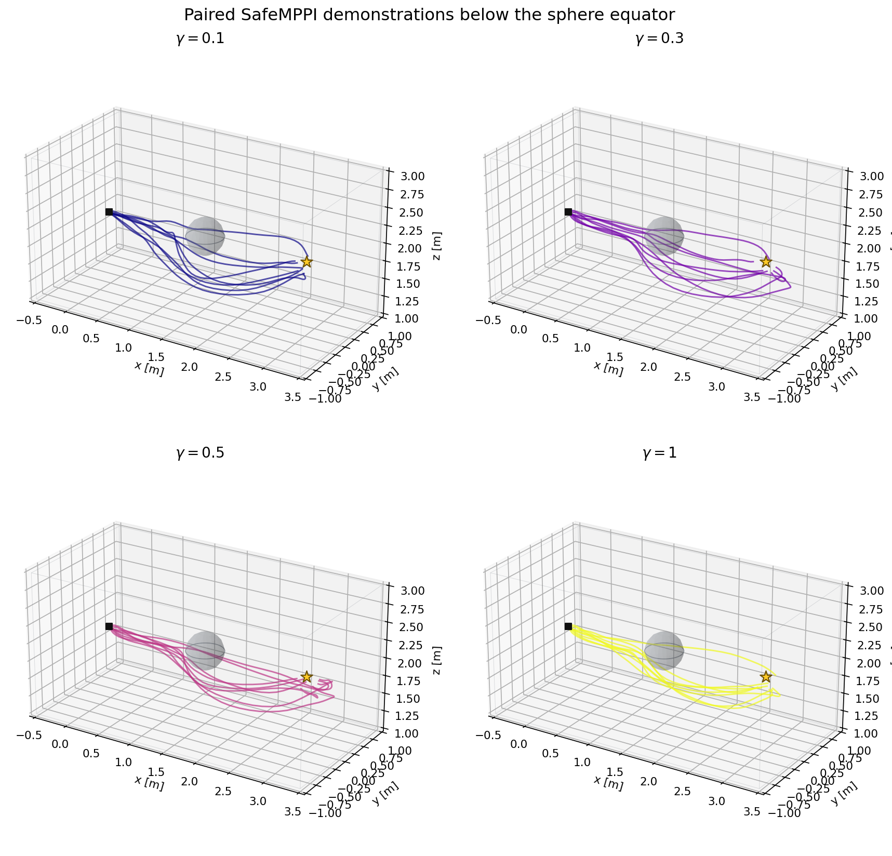 |

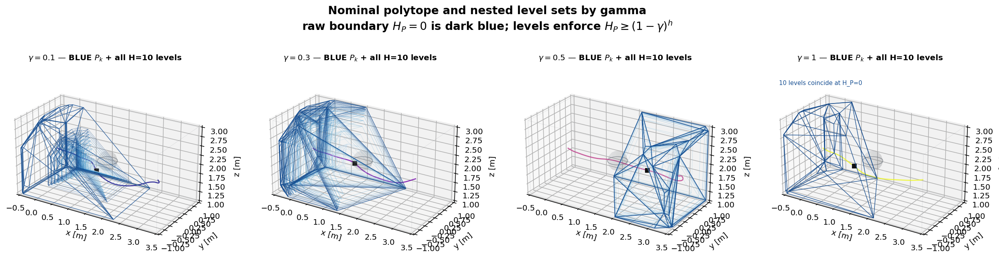

## Deployment testing (`deploy_sim/`)

The controller here has been flown on a real quadrotor. What breaks real flights
is rarely the planning geometry — it is the deployment layer: a finite replan
rate, setpoint streaming, a vehicle that lags and overshoots, noisy state
estimates, geofences and dropouts.

[`deploy_sim/`](deploy_sim/) runs a controller through **the same loop used on
the vehicle**, against a quadrotor model with those properties (real onboard
Mellinger gains, thrust limits, estimator lag, measurement noise, a jittery
~90 Hz clock). It needs nothing beyond `requirements.txt` — no simulator, no
ROS, no motion capture, no vehicle:

```bash
python deploy_sim/run_offline.py --config configs/crazyflie_mppi_corner.json
python deploy_sim/run_offline.py --controller mymodule:MyController   # your own
python deploy_sim/run_offline.py --fault-freeze-at 3.0                # dropout test
```

Any object with `reset()` and `plan(state, goal, gamma, seed) -> (accel, info)`
can be tested. See [`deploy_sim/README.md`](deploy_sim/README.md) for the
protocol, what the model does and does not capture, and how to read the safety
summary; [`docs/EXPERIMENT_PARAMS.md`](docs/EXPERIMENT_PARAMS.md) records the
parameters used in the real trials and the measurements behind them.

The temporary [`flow_deployment/`](flow_deployment/) adapter loads the
canonical frozen flow checkpoint and calls it from that unchanged deployment
loop. It maps the lab start/goal/sphere into the policy frame, retains the
complete controller trace, and produces native `deploy_sim` outputs plus a
frame-comparison figure:

```bash
python scripts/run_flow_deployment.py \
  --episodes 20 \
  --output outputs/flow_deployment/pretrained_corner \
  --gif
```

This is an offline software-interconnection diagnostic. It performs no online
expansion or motion-capture collection and supplies no flight-safety guarantee.
The adapter pins every Minhyuk deployment file by SHA-256 and refuses to run if
one changes.

## Dynamics and task geometry

The state is `x=[p,v]` in R6 and the controller commands acceleration `u` in R3:

```text
p[k+1] = p[k] + dt v[k] + 0.5 dt^2 u[k]
v[k+1] = v[k] + dt u[k]
```

The taskspace is a rectangular box. Static sphere rows are `[x,y,z,radius]`; vertical cylinder rows
are `[x,y,radius]` and span the full taskspace height:

```json
"obstacles": {
  "spheres": [[2.5, 2.5, 2.0, 0.4]],
  "cylinders": [[3.5, 1.5, 0.3]]
}
```

The requested default start and goal lie on taskspace faces. They are not silently shifted inward.
That makes the corresponding box margin zero at those points; visualization therefore chooses a
strict-interior rollout state when it needs explicit polytope vertices.

## BLUE nominal polytope and `H_P`

At every control period, [`geometry.py`](safe_mppi/geometry.py) builds

```text
P_k = 2 m sensing polyhedron
      intersect obstacle tangent halfspaces
      intersect taskspace box halfspaces.
```

The sensing polyhedron comes from a once-subdivided icosahedron: 42 sphere vertices define 80
nearly uniform triangular faces. There is no Fibonacci direction index. Sphere and cylinder faces
are tangent to the raw obstacle radius because every hard margin is fixed to zero.

For `P={x: A x <= b}` centered at the current robot position `c`, the normalized field is

```text
H_P(x) = min_i (b_i - a_i^T x) / (b_i - a_i^T c).
```

`H_P(c)=1` for a strict-interior center and `H_P(x)=0` on the active boundary. The geometry audit
below shows the shared 80 angular directions and the nonuniform radial samples used by the broader
3D experiment: 5 cm spacing through 0.2 m, 10 cm spacing through 0.5 m, then 1 m and 2 m context.

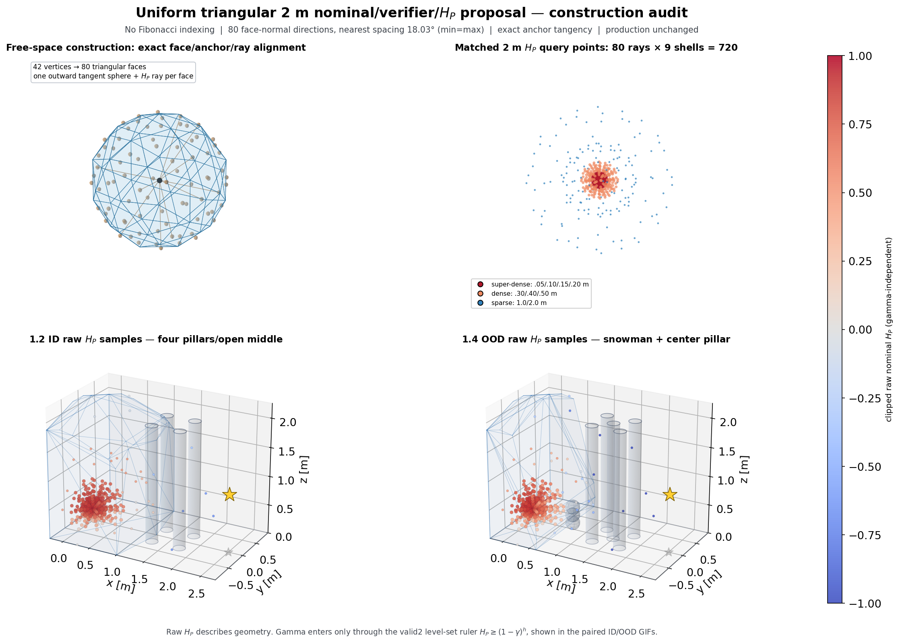

## The only sampler: mode 1

[`Mode1SafeMPPI`](safe_mppi/controller.py) shifts the previously optimized control sequence, adds
Gaussian perturbations, and biases a subset of samples toward the nominal-polytope centroid when the
local polytope becomes tight. Noise along that centroid direction is anisotropically amplified.

Each sampled horizon is rejected when any step violates

```text
H_P(q[h+1]) >= (1-gamma) H_P(q[h]).
```

Smaller gamma contracts admissible motion more gradually; gamma 1 admits the raw `H_P>=0`
boundary immediately. The cost ranks feasible samples using goal error, control effort, the
user-approved control-smoothness term, progress, and a soft proximity preference. The proximity
term changes ranking only—it does not enlarge obstacles.

Only the first averaged action is executed. The next control period senses again and rebuilds the
polytope. If every sampled horizon is infeasible, the implementation explicitly ranks samples by
their worst `H_P` value; the saved `online_one_step_slack` lets downstream checks detect whether the
executed fallback remained admissible.

## Outputs and metric definitions

For every gamma and seed, `run.py` saves:

- `states`, `controls`, and the exact per-step `poly_A/poly_b` in compressed NPZ form;
- sampled feasible fraction and executed one-step barrier slack;
- success rate (`SR`): reached the goal without collision or taskspace violation;
- collision rate (`CR`): any negative dense-time obstacle clearance;
- average minimum obstacle clearance;
- average time to reach the goal among reaching episodes; and
- taskspace-violation rate and average planning time.

The checked-in one-seed reference metrics are in
[`examples/default_metrics.csv`](examples/default_metrics.csv). These are mechanism checks, not
M25/M100 statistical claims.

| default output | nominal level sets |
|---|---|
| 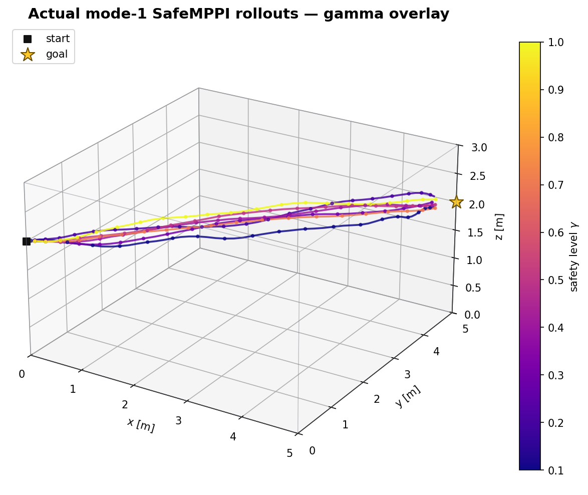 | 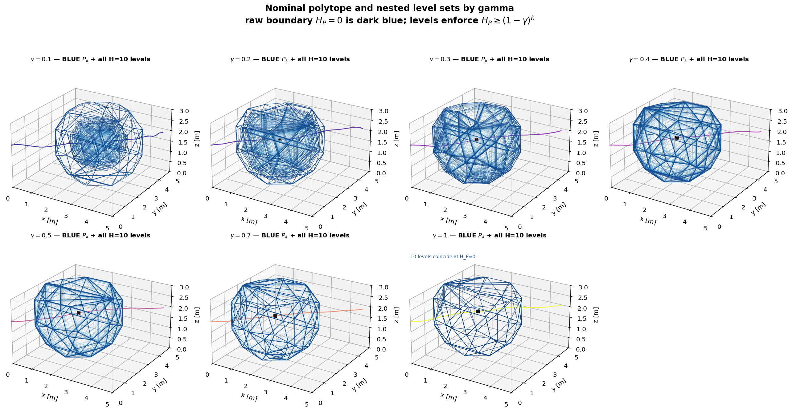 |

## ID/OOD mechanism gallery

The repository also preserves the generated conceptual and actual-rollout visuals from the dense
pillar experiment. They demonstrate the uniform `H_P` field, all ten horizon levels, gamma masking,
and the distinction between the BLUE online nominal polytope and GREEN post-hoc SOCP verifier.

| in-distribution: four pillars/open middle | OOD: restored center pillar + overlapping spheres |
|---|---|
| 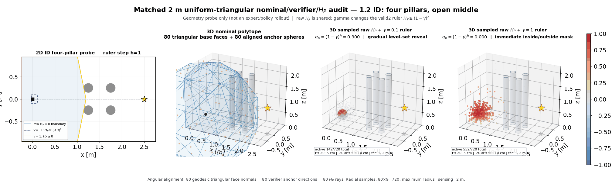 | 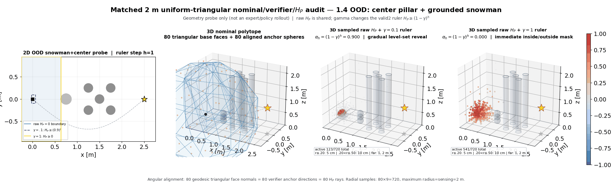 |

See the [complete per-gamma visual atlas](docs/VISUALS.md) for all 14 actual rollout GIFs and their
outcomes. The GIFs are evidence imported from the broader experiment; `run.py` in this minimal
repository generates static PNG figures, not those detailed three-panel animations.

## Standalone B1 Safe Flow Expansion

The implementation in [`safe_mppi/expansion.py`](safe_mppi/expansion.py) is a single AFE arm: no
expert fallback, demo replay, proximal leash, curriculum, recovery starts, rollback, or evaluation
temperature search. [`ConditionalFlowMLP`](safe_mppi/flow_model.py) is a lightweight default, but a
task can replace it while preserving the same expansion loop.

For candidate plan `U`, context `c`, and optionally its paired initial flow base `x_0`, the current
policy supplies the penultimate noised representation

```text
phi_s(U,c,x_0) = trunk([(1-s)x_0+sU, c, time(s)]).
```

The paired form is enabled explicitly; endpoint-only `phi_s(U,c)` remains available for controlled
ablations. Normalize the representations and initialize the RBF length scale from 50 pretrained
samples:

```text
ell = mean_{i<j} || normalize(phi_i) - normalize(phi_j) ||_2
k(z,z') = exp(-||z-z'||^2 / (2 ell^2))
sigma_n^2(z) = k(z,z) - k(z,Z+) [K(Z+,Z+) + lambda I]^{-1} k(Z+,z).
```

The default `recent_current_phi` reference re-embeds recent full-verifier positives under the
current round's policy. The implementation also exposes named, auditable frozen/cumulative/sliding
references for experiments; a numerical GP matrix is never carried across a representation update.
For successful-trajectory sliding references, rows are sampled uniformly over the complete
successful trajectories rather than taking only late FIFO windows. At each active context, sample
`K` plans and acquire `B` sequentially:

```text
pi(j | pending) proportional to exp((sigma_j - max sigma) / beta).
```

Every successfully evaluated selected-B query enters `D` under the default archive rule; only
full-H safety positives enter `D+`. Archive rules that commit only complete successful executed
trajectories are separate options and are never silently mixed with query-level replay. The
task adapter, not the generic core, defines GREEN validity, progress, terminal-tail handling, and
the execution ranking. No eligible plan means `NVP`; the BLUE nominal one-step value is diagnostic
only.

After a round, recent `D+` replay has equal mass over
`gamma -> (round, episode) -> context -> positive query`. With
`optimizer_steps_per_round=None`, every eligible positive is used exactly once without
replacement; `microbatch_repeats` controls repeated optimization on each microbatch separately.
Optional negative gradients use

```text
g = g_positive - rho g_negative,
rho = alpha ||g_positive|| / (||g_negative|| + eps).
```

`alpha=0` is exactly the positive-only update. NVP-context queries are the negative population; they
do not become positive GP observations.

`checkpoint_000.pt` is always the untouched pretrained policy. Updates produce
`checkpoint_001.pt,...,checkpoint_N.pt`; result curves and galleries must evaluate those saved
checkpoints with a separate, untilted raw-policy seed bank.

### Variables to change first

These are code defaults, not a universal tuned recipe.

| variable | default | meaning |
|---|---:|---|
| rounds / parallel episodes per gamma | `10 / 2` | independent synchronous trajectories |
| `K / B` | `16 / 4` | generated plans / sequential full-verifier queries |
| batch / optimizer steps / microbatch repeats | `32 / exact pass / 1` | replay optimization budget |
| learning rate / first-layer scale | `3e-5 / 1` | first layer can move more slowly during expansion |
| replay window `W` | `2` rounds | labeled replay horizon |
| RBF GP cap / noise | `256 / 1e-2` | uncertainty reference size and regularization |
| GP reference | `recent_current_phi` | re-embed recent positives under current `phi_s` |
| sliding-row selector | `trajectory_uniform` | sample throughout each successful trajectory |
| beta / adaptive beta / ESS target | `.05 / false / .5` | fixed tilt by default; adaptive ESS is opt-in |
| flow base std / paired representation | `1 / false` | base sampling and noised-feature ablation |
| archive / execution | `all_queries / min_cost` | query-level data; task-native ranking |
| negative alpha | `0` | positive-only update |

For a fixed initial beta, collect representative uncertainty score pools, call
`calibrate_fixed_beta(pools, target=.5)`, write the returned scalar into `ExpansionConfig.beta`, and
leave `adaptive_beta=False`. Do not choose beta from the absolute magnitude of sigma alone.

### Porting to another 3D task

Implement the five methods in `ExpansionTask`: `reset`, `context`, `verify`, `advance`, and
`terminal`. The verifier returns
`Verification(valid, hp_eligible, margin, execution_cost, progress, progress_eligible, error)`.
That is the only place where task-specific dynamics, a 3D nominal polytope, SOCP geometry, progress,
and the native SafeMPPI cost belong. Supply 50 pretrained embeddings or an explicitly justified RBF
length scale, then call `run_safe_expansion`.

[`expansion_visualize.py`](safe_mppi/expansion_visualize.py) provides three task-neutral outputs:

- `plot_expansion_results`: result curves from `metrics.jsonl`;
- `plot_rollout_gallery`: overlaid raw-policy trajectories by round and gamma; and
- `render_expansion_mechanism`: K plans, selected-B uncertainty, verifier positives, executed first
  action, accumulated positive/NVP states, and a `sigma(phi_s)` colorbar.

Pass an `event_callback` to `run_safe_expansion` to receive the state before/after replanning, all K
candidates and marginal uncertainties, selected B indices, verifier outputs, and the executed index.
The task adapter converts candidate controls to 3D paths and nominal/verifier polytope vertices
before constructing `MechanismFrame`; the generic core does not guess that geometry.

Reference mechanism video: [B1 rounds 0/5/10/15](docs/assets/b1_expansion_mechanism_reference.mp4).

### Ball-task deployment: pretraining + expansion + representation audit

[`docs/BALL_FLOW_EXPANSION.md`](docs/BALL_FLOW_EXPANSION.md) deploys this loop end to end on the
20-inch-ball task with the 10-D context `c_t = [g-p, v, b_near-p, gamma]` and a 30-D plan flow
(`scripts/pretrain_ball_flow.py`, `scripts/run_ball_expansion.py`,
`scripts/evaluate_ball_expansion.py`, `safe_mppi/ball_flow_diagnostics.py`). It reports raw
temperature-1 success/collision, above/below/left/right route coverage, untilted GREEN-verifier
validity, gamma trends against the SafeMPPI demonstrator, sigma-tilted acquisition anatomy, and
an automated fixed-bank audit of the penultimate noised representation (t-SNE panels, local
probes, and the high-sigma new-mode discovery rate), plus an automated data-size x model
discovery sweep (`scripts/sweep_ball_flow.py`) and the final
[coverage video](docs/assets/ball_flow/coverage_video.mp4): expansion iterations progressively
cover the ball with generated trajectories while the metric curves grow. Curated figures live in
[`docs/assets/ball_flow/`](docs/assets/ball_flow/).

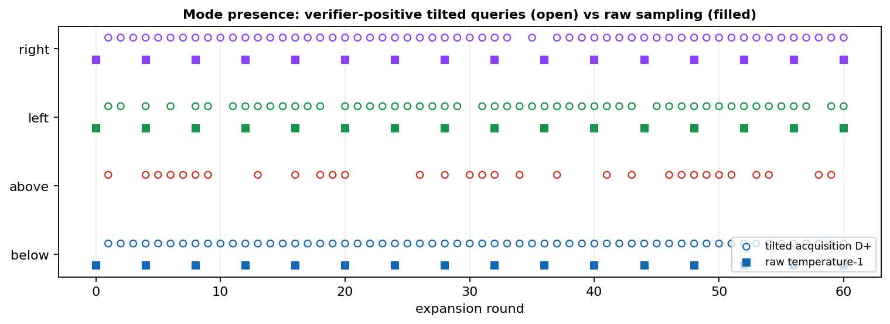
It is a format reference, not evidence for this new 3D ball task.

The portable canonical pretraining bundle is checked in at
[`results/global50_reference/pretrain_global10_h48p32_s0`](results/global50_reference/pretrain_global10_h48p32_s0):
200 successful SafeMPPI demonstrations (50 per gamma), 7,039 training windows, the 4,574-parameter
`41 -> 48 -> 32 (=phi_s) -> 30` raw-time flow, calibration features, and its manifest. Its fixed
raw audit is SR `0.4625` with window validity `0.9040`; it is a reproducible starting policy, not a
flight-readiness claim.

## Code reading order

1. [`default_config.json`](default_config.json) — the entire public experiment contract.
2. [`safe_mppi/config.py`](safe_mppi/config.py) — typed loading and strict zero-margin/mode checks.
3. [`safe_mppi/environment.py`](safe_mppi/environment.py) — dynamics, collision clearance, and goal.
4. [`safe_mppi/geometry.py`](safe_mppi/geometry.py) — uniform triangular polytope and `H_P`.
5. [`safe_mppi/controller.py`](safe_mppi/controller.py) — mode-1 sampling, costs, and safety filter.
6. [`safe_mppi/acquire.py`](safe_mppi/acquire.py) — per-gamma execution, NPZ schema, and metrics.
7. [`safe_mppi/visualize.py`](safe_mppi/visualize.py) — reproducible rollout and level-set figures.
8. [`safe_mppi/flow_model.py`](safe_mppi/flow_model.py) — lightweight task-sized conditional flow.
9. [`safe_mppi/expansion.py`](safe_mppi/expansion.py) — task-neutral B1 expansion loop.
10. [`safe_mppi/expansion_visualize.py`](safe_mppi/expansion_visualize.py) — result/gallery/video skeletons.

Run the semantic tests with:

```bash
python -m pytest -q
```

## Scope and limitations

- The robot is a point mass; real vehicle radius, tracking error, and hardware latency are absent.
- Obstacles are static spheres or full-height vertical cylinders.
- The SafeMPPI data collector implements online nominal `H_P`. The ball-task expansion adapter
  separately implements the cloned verifier's trajectory-fitted max-margin face constraints in
  3-D for spherical obstacles; this GREEN verifier is not part of the expert controller.
- The checked-in ball checkpoint is an ideal-double-integrator research model. It is not a
  Crazyflie flight certificate; deployment requires an explicit coordinate/action interface and
  independent evaluation on the target vehicle.
- The 80x9 learned encoder, adaptive gamma, wind robustness, and moving-obstacle prediction are not
  implemented here.
- The platform authority is recorded for downstream work, while this demonstration controller is
  intentionally capped at `1.2 m/s^2`.
- One paired seed per gamma is sufficient to reproduce the supplied visuals, not to support a
  general performance claim.
