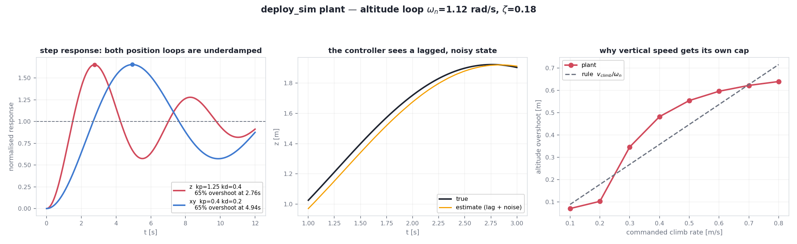

# `deploy_sim` — test a controller the way it is actually flown

Planning in a clean geometric simulator is not what breaks real flights. What
breaks them is the deployment layer: a finite replan rate, setpoint streaming, a
vehicle that lags and overshoots its setpoint, noisy state estimates, geofences,
and occasional dropouts.

This package runs a controller through **exactly the loop used on the real
vehicle**, against a quadrotor model that has those properties. Only the plant
differs between this and a real flight.

**It needs nothing beyond `requirements.txt`** — no simulator install, no ROS,
no motion capture, no vehicle.

```bash
python deploy_sim/run_offline.py --config configs/crazyflie_mppi_corner.json
```

Outputs land in `outputs/deploy_sim/`: a CSV/NPZ log (measured **and** commanded
state, so tracking error is directly measurable) and figures showing the
trajectory, the nominal polytope with its `H_P` level sets, and altitude.
Add `--gif` for an orbiting animation.

## Testing your own controller

Implement two methods:

```python
class MyController:
    def __init__(self, cfg, env, device="cpu"):   # cfg = the "safemppi" config block
        ...
    def reset(self):                              # called once per run
        ...
    def plan(self, state, goal, gamma, seed=0):
        # state : (6,) [x, y, z, vx, vy, vz]
        # goal  : (3,)
        # return: (3,) commanded ACCELERATION [m/s^2], and an info dict
        return u, {}
```

then

```bash
python deploy_sim/run_offline.py --controller mymodule:MyController
```

[`example_controller.py`](example_controller.py) is a working template (a naive
PD law). Run it and compare — it reaches the goal but cuts **inside** the
obstacle safety sphere, which is the sort of thing this harness is for.

`gamma` is the barrier-contraction parameter used by the bundled SafeMPPI;
ignore it if your method has no equivalent.

## The acceleration is a feedforward, not a motor command

Each plan is converted to a kinematically consistent full-state setpoint and
streamed at ~100 Hz between 10 Hz replans:

```
v_ref <- v_ref + u·dt        p_ref <- p_ref + v_ref·dt        a_ref = u
cmdFullState(p_ref, v_ref, u, yaw=0, omega=0)
```

The vehicle's onboard position controller tracks that setpoint. So `u` never
goes to motors; it is the acceleration feedforward. A reference governor keeps
`p_ref` within `--max-lead` of the measured position so the setpoint can never
run away.

## What the plant looks like



Three equations, applied at 1 kHz:

```python
a = KP*(p_ref - p_est) + KD*(v_ref - v_est) + a_ff   # onboard loop, on the ESTIMATE
a = clip(a, +-5.5 xy, +9/-5 z);  v += a*dt;  p += v*dt   # thrust limit, rigid body
p_est += (dt/tau)*((p + noise) - p_est);  v_est = d/dt(p_est)   # lagged, noisy state
```

The important detail is that both the onboard loop *and* your controller see
`p_est`, never `p` — that lag is where tracking error comes from.

Regenerate the figure after changing any parameter:

```bash
python deploy_sim/characterise_plant.py
```

Left: both loops overshoot ~65 % and ring for seconds (altitude
`omega_n = 1.12 rad/s`, `zeta = 0.18`; lateral is slower still at 0.63 rad/s).
Middle: the estimate trails the truth. Right: overshoot grows with climb rate
along `v_climb / omega_n`, which is why vertical speed gets its own tighter cap.

**Not modelled:** attitude/inner-loop dynamics (acceleration is assumed
achieved, subject to limits), motor dynamics, drag, ground effect and downwash,
battery sag, yaw, and radio packet loss (lumped into the estimator lag). A real
vehicle must rotate before it can accelerate laterally, which adds lag this
model skips — one reason it under-predicts peak altitude overshoot.

## What the model includes

| effect | why it matters |
|---|---|
| onboard position loop with real Mellinger gains | `kp_z=1.25, kd_z=0.4` ⇒ damping ratio ≈ 0.18, so altitude **overshoots ~65 %** (56 % is the zero-lag ideal; the estimator lag adds the rest) |
| finite thrust | bounded acceleration, asymmetric in ±z |
| state-estimator lag | roughly half of the steady tracking error |
| measurement noise (1.7 mm rms) | forces you to filter before differentiating |
| ~90 Hz jittery control clock | not the perfect 100 Hz you asked for |
| no `velocity()` | the controller must finite-difference position, as in the field |

A useful rule that falls out of the altitude gains:

> altitude overshoot ≈ v_climb / ω_n,  ω_n = √kp_z ≈ 1.12 rad/s

so a 0.5 m/s climb overshoots ~0.45 m. Capping *vertical* speed is far more
effective than capping total speed, and routing **around** an obstacle rather
than **over** it avoids the problem entirely.

## Honest limits

* The plant is a **model**, not vehicle firmware. Gains are stock Crazyflie
  Mellinger values; lag/noise/rate were fitted to a single real flight.
* Validated on that flight: it reproduced a geofence exit to within **8 mm** and
  matched the altitude step-response prediction (57 %/2.84 s modelled vs
  56 %/2.86 s theoretical) — where a kinematic simulator reported success.
* It still **under-predicts peak altitude overshoot**.
* Use it to catch deployment problems and to compare controllers. Do not use it
  to justify shrinking real safety margins.

## Safety layers (identical to the flight configuration)

| layer | trigger | response |
|---|---|---|
| soft geofence | leaves the flight volume | stop and land in place |
| hard geofence | leaves it by a further margin | emergency stop |
| over-speed | > 1.8 × cap | land |
| runaway speed | > 2.5 × cap | emergency stop |
| frozen/invalid state estimate | no change for `--state-timeout` (0.3 s) | land |
| setpoint clamp | always | commanded position kept inside the fence |

The frozen-estimate check earns its place: a stale pose looks perfectly healthy
— finite, inside the fence, reporting zero finite-difference velocity — while
the vehicle keeps flying. Test your controller against it:

```bash
python deploy_sim/run_offline.py --fault-freeze-at 3.0
```

## Reading the summary

```
outcome                          reached goal
closest_to_goal_m                0.241     # must exceed nothing; but the arrival
                                           # tolerance must exceed tracking error
clearance_beyond_safety_sphere_m 0.026     # <0 means inside the configured shell
peak_speed_mps                   1.03      # achieved, vs the commanded cap
fence_margin_m                   0.154     # <0.10 ⇒ expect an abort on hardware
peak_z_m                         1.143
```

Two traps worth knowing, both learned the hard way:

1. **Arrival tolerance must exceed tracking error.** A run once passed 0.162 m
   from the goal with a 0.15 m tolerance, so "reached" never fired and the
   vehicle flew on past and out of the fence.
2. **Differentiate over ~0.1 s, not sample-to-sample.** At 100 Hz with
   millimetre noise, a raw finite difference reports roughly double the true
   speed. `summarize()` already does this; do the same in your own analysis.

## Geofence

Taken from an optional top-level `"safety"` block in the task config:

```json
"safety": { "safe_min": [-2.5, -1.7, 0.4], "safe_max": [1.3, 1.8, 2.0] }
```

`load_config` ignores unknown top-level keys, so this is safe to add. Without
it, the fence is derived from the taskspace. Note the barrier is *reactive*: the
controller will plan right up to the taskspace bound and overshoot carries it
past, so keep the **taskspace** ceiling below the **fence** ceiling.

See [`../docs/EXPERIMENT_PARAMS.md`](../docs/EXPERIMENT_PARAMS.md) for the
parameters used in the real trials and the measurements behind them.
