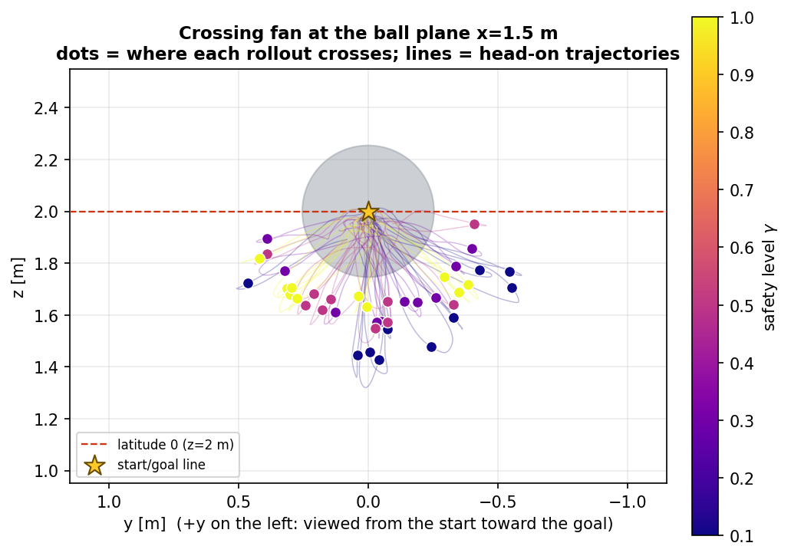
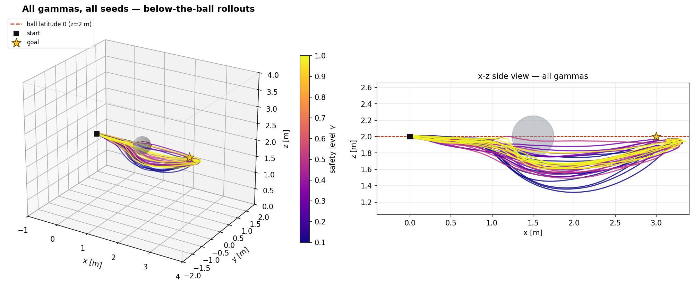
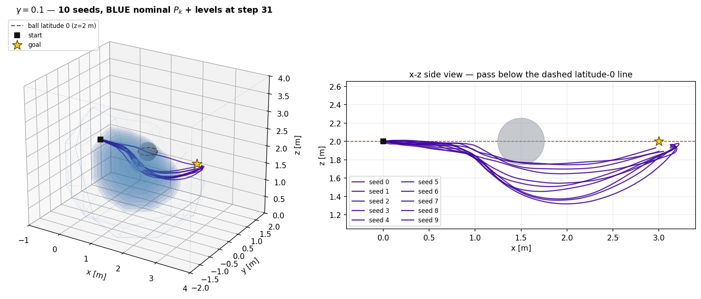
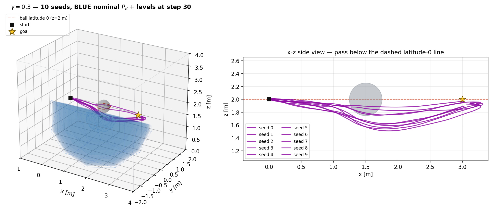
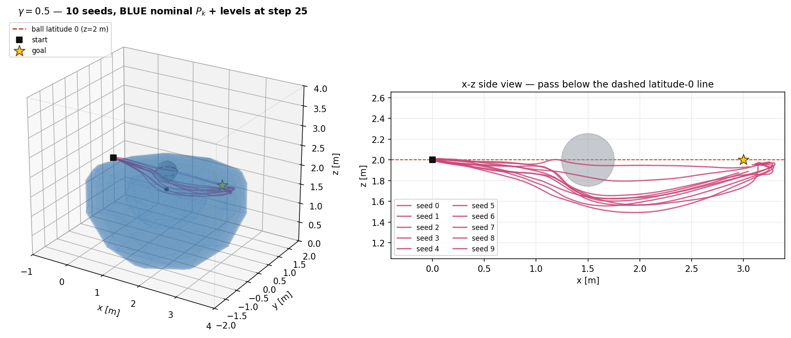
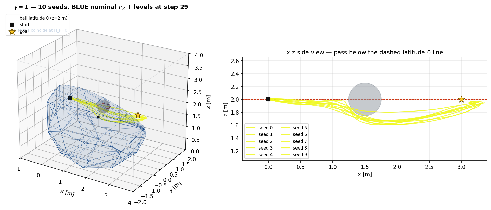
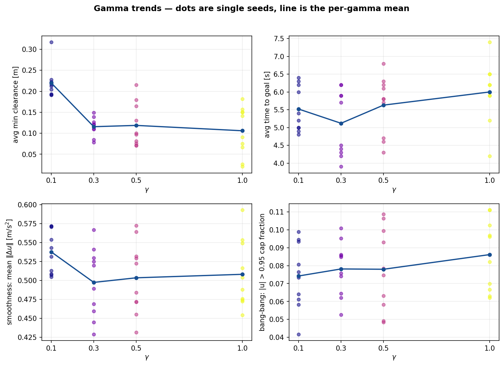

# Ball-below task: z-biased SafeMPPI grazing under a 20-inch ball

## Task definition

| item | value |
|---|---|
| start | position `(0, 0, 2)` m, velocity `0` |
| goal | `(3, 0, 2)` m, reach radius `0.15` m |
| obstacle | one sphere ("20-inch ball", radius `0.254` m) at the segment midpoint `(1.5, 0, 2)` |
| taskspace | `[-1,4] x [-2,2] x [0,4]` m (start/goal strictly interior) |
| requirement | every rollout passes **below the ball's latitude-0 circle** (its `z=2` equator); viewed from the start toward the goal, the seed family **fans out across angles** below the plane instead of bunching at straight-down |
| demonstration control cap | `1.0 m/s^2` per axis (intentionally reduced from 1.2) |
| warm start | first plan is seeded with `initial_control = [0.1, 0, 0] m/s^2` so the robot immediately sets off toward the goal |
| gamma grid | `0.1, 0.3, 0.5, 1.0`, ten paired seeds each |

Everything lives in [`ball_below_config.json`](../ball_below_config.json); run with

```bash
python run.py --config ball_below_config.json --output outputs/ball_below_final --device cpu
python -m safe_mppi.ball_analysis --run outputs/ball_below_final   # figures + metrics
python -m safe_mppi.ball_gif      --run outputs/ball_below_final   # per-gamma GIFs
```

## What was added to the package

1. **Exponential altitude bias** (`controller.py`): every rollout step pays
   `z_bias_weight * exp((z - z_bias_plane) / z_bias_temperature)`, exponent clamped at 20.
   With `w=0.1`, `T=0.025` the term is a one-sided wall: `~0.002` at `z=1.9` (negligible, as
   requested), `0.1` at the latitude itself, `5.5` per step at `z=2.1`. It forbids going over the
   ball and gently tips the otherwise isotropic detour family below the plane — weak enough that
   the seeds spread across passage angles instead of all diving straight down.
2. **Warm-start bias** (`controller.py`): when no previous plan exists, the nominal control
   sequence is `initial_control` instead of zeros.
3. Both knobs are optional config fields with inactive defaults (`config.py`); the default
   experiment is unchanged and the original tests still pass.
4. **`safe_mppi/ball_analysis.py`**: per-gamma seed overlays (3D + soft-filled BLUE nominal
   polytope with its `H_P` level sets + x-z side view), the head-on **crossing fan**, gamma-trend
   panels, and `ball_metrics.json/csv` including the passage angle of every rollout.
5. **`safe_mppi/ball_gif.py`**: per-gamma GIFs — all ten seeds animate while the representative
   seed's nominal polytope evolves step by step; the polytope interior is translucent (level sets
   read as nested tint bands, not wireframe) and the camera orbits ~100 degrees so the polytope is
   seen from different angles.

## Final cost recipe (only state, control, terminal + the z penalty)

Soft proximity preference and the progress reward are **disabled** (`0.0`). The surviving costs:

| term | weight | note |
|---|---:|---|
| running goal `\|p-g\|^2` | 2.0 | isotropic in y/z: the detour angle is left free on purpose |
| control `\|u\|^2` | 1.0 | |
| control smoothness `\|du\|^2` | 1.0 | increased from the 0.12 default |
| terminal goal `\|p_H-g\|^2` | 30.0 | raised from 20 to stop the small circle-back at the goal |
| z bias `0.1 exp((z-2)/0.025)` | — | the only symmetry breaker |

Sampling: `1024` samples, **isotropic** `sigma=(0.35, 0.35, 0.35)` (y-z isotropy is what lets the
fan open), MPPI temperature `0.3`, centroid mixture calmed to `gain=0.05`, `sigma_aniso=1.5`.

The pure equal-weight setting (`1/1/1`, MPPI temperature 0.1, sigma 1.0) was measured first: it is
safe and below-latitude but does not converge (7/20 timeouts) because the near-goal cost landscape
is flatter than the sampling noise. The final recipe keeps the state/terminal per-step channels
balanced and applies the small position-control bias the task brief anticipated. An earlier
stronger wall (`w=0.4`) held every seed pinned at the straight-down angle; relaxing it to `0.1`
opened the angular fan without a single above-latitude crossing.

## Measured results (10 seeds per gamma, 40/40 successful, all below latitude 0)

| gamma | passage angles wrt -y axis [deg] | avg min clearance [m] | avg time to goal [s] | mean \|du\| | \|u\|>0.95cap |
|---:|:---:|---:|---:|---:|---:|
| 0.1 | 23-149 (std 37) | **0.220** | 5.52 | 0.538 | **0.074** |
| 0.3 | 20-165 (std 44) | 0.116 | 5.12 | 0.497 | 0.078 |
| 0.5 | 7-157 (std 41) | 0.119 | 5.63 | 0.503 | 0.078 |
| 1.0 | 36-157 (std 43) | 0.106 | **6.00** | 0.508 | **0.086** |

- **Angular fan**: passage angles span 7-165 degrees (0 = grazing on the -y side, 90 = straight
  below, 180 = +y side) with per-gamma std ~40 degrees — the head-on view shows a spread ring
  below the latitude line rather than a single downward channel.
- **Clearance**: monotone at the extremes — gamma 0.1 keeps `0.22` m (twice everyone else) and
  gamma 1.0 grazes closest (`0.106` m). The single tangent face makes gamma 0.1 treat a
  constant-clearance pass as "approaching the boundary", so it swings wide.
- **Time to goal**: in this fan regime gamma 1.0 is the *slowest* (6.0 s) — late bang-bang
  corrections and the tightest grazes cost time — while gamma 0.1's wide arcs are traversed at
  speed. (When the wall was strong and every seed went straight under, gamma 0.1 was the slowest;
  the ordering is regime-dependent.)
- **Smoothness / bang-bang**: cap-saturation rises monotonically with gamma — gamma 1.0 is the
  most bang-bang, as theory predicts. Moderate gammas (0.3/0.5) have the lowest control jitter;
  gamma 0.1 is the jitteriest because the tight contraction keeps fighting the sampler.

## Figures and GIFs

Checked-in copies of the final run live in [`docs/assets/ball_below/`](assets/ball_below/).

Head-on crossing fan (viewed from the start; +y on the left):



All gammas, all forty rollouts:



Per-gamma 10-seed overlays with the translucent nominal polytope and its level bands:






Gamma trends (dots are single seeds, line is the mean):



Animated rollouts with the evolving polytope and orbiting camera:

| gamma 0.1 | gamma 0.3 |
|---|---|
|  |  |

| gamma 0.5 | gamma 1.0 |
|---|---|
|  |  |

## Tuning journey (what mattered)

| change | effect |
|---|---|
| `w_z` 1.0 -> 0.4 with sharp `T=0.025` | stops the start-line dive; wall above `z~2.05` still absolute |
| reach radius 0.25 -> 0.15 | removes the "finish low inside the reach ball" shortcut |
| terminal 1 -> 20 -> 30 | fixes near-goal wandering, then the residual circle-back hook |
| running 1 -> 2 | arrests the post-ball sink, brakes the goal overshoot |
| centroid `gain 0.2 -> 0.05`, `aniso 2.5 -> 1.5` | the escape mixture was injecting full-cap downward kicks near the ball (bottom 1.1 m -> 1.45 m) |
| samples 512 -> 1024 | kills the rare gamma-0.1 all-infeasible flee/out-of-bounds episode |
| `w_z` 0.4 -> 0.1 + isotropic `sigma_y` 0.35 | opens the below-plane fan: passage angles 7-165 deg instead of everything at 90 deg |
| smooth weight 2.0, narrow `sigma_y` (tried) | **reverted** — sluggish committed arcs / pinned angles |
