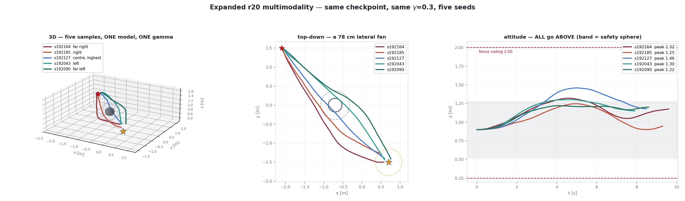

# Expanded r20 — independent multimodality screen (γ = 0.3 fixed)

Screen of `flow_deployment/minhyuk_handoff/expanded_visual_nozB5_r20.pt`
(SHA-256 `f7ce5e52…6b00`) at **fixed γ = 0.3**, temperature 1.0, on
`configs/experiment1_lab_ball.json`. Only the flow sampling seed varies, so any
spread here is the policy's own multimodality rather than a conditioning effect.

Method is two-stage. **Search:** 200 seeds (192000–192199) rolled through the
deployment reference-governor recurrence — fast, and a close proxy because the
offline vehicle follows the streamed setpoint exactly. **Validation:** the diverse
survivors re-run through a hardware control loop (10 Hz deadline scheduler,
geofence, speed aborts, mocap watchdog). Routes are classified at closest approach
to the obstacle: whichever of the vertical or cross-track offset dominates.

This is a seed screen, **not** an unbiased success-rate estimate and **not** a
flight safety certificate.

## Result 1 — the below route is gone, and it is not a search artefact

| vertical offset at closest approach | value |
|---|---|
| seeds passing below the obstacle centre | **2 / 200** |
| deepest offset | **−0.025 m** (level, not below) |
| 10th percentile | +0.144 m |
| median | +0.294 m |
| max | +0.670 m |

Route counts over 200 seeds: **above 129, right 40, left 31, below 0.**

This confirms the handoff's reported `below/above/left/right = 0/23/1/16` and
sharpens it: a 4× larger seed search at a fixed γ still finds no below route. The
deepest sample of two hundred clears the obstacle centre by −25 mm, which is level
flight, not an under-pass. The below mode is genuinely absent from this
checkpoint, not merely rare.

For contrast, the same screen on `pretrained_visual_hp3d.pt` over 48 seeds gives
**below 31, above 0, left 8, right 9** — the two checkpoints are complementary and
neither spans both vertical modes. A demonstration needing both up and down routes
requires both checkpoints.

## Result 2 — the multimodality that *is* there is lateral

Cross-track offset spans **−0.823 m to +0.500 m** (113 seeds left of the travel
direction, 87 right). Combined with a climb range of 1.05–1.55 m among reaching
seeds, the reachable mode space is a lateral fan at varying height over the
obstacle.

Five seeds spanning that space, all re-validated through the hardware control loop
(period 100.0 ms, **0 deadline overruns**, peak speed ≤ 0.79 m/s):

| seed | mode | cross-track | peak z | min z | fence margin | clearance to ball shell | duration |
|---|---|---|---|---|---|---|---|
| 192164 | far right | −0.474 m | 1.322 m | 0.900 m | 0.200 m | 0.390 m | 9.6 s |
| 192185 | right | −0.357 m | 1.248 m | 0.900 m | 0.300 m | 0.240 m | 9.3 s |
| 192127 | centre, highest | −0.135 m | **1.460 m** | 0.900 m | 0.298 m | 0.347 m | 8.5 s |
| 192043 | left | +0.181 m | 1.303 m | 0.900 m | 0.262 m | 0.207 m | 7.9 s |
| 192090 | far left | +0.304 m | 1.222 m | 0.900 m | 0.285 m | 0.218 m | 8.6 s |

A 78 cm lateral fan across the obstacle. Full per-seed data, including all 13
flight-loop validated runs, is in `assets/expanded_r20_multimodality_screen.json`.



## Result 3 — validate in the loop you will actually run

Of 18 candidates that reached in the search stage, **13 reached in the hardware
control loop** and 5 did not. The loop also reported systematically tighter
obstacle clearances: one candidate the search put 116 mm from the obstacle shell
came within 11 mm in the loop.

The two differ in their reference-governor caps and command clamping, so agreement
cannot be assumed. Screen with the search stage; qualify with the loop that flies.

## Result 4 — thread oversubscription destroys the control budget

The visual policy is 28 558 parameters with a 3×16×12×12 Conv3D encoder. On a
28-core machine where torch defaults to 20 intra-op threads, one `plan()` call
costs **142 ms** — more than an entire 100 ms control period:

| torch intra-op threads | median per `plan()` | max |
|---|---|---|
| 20 (library default here) | **142.05 ms** | 169.77 ms |
| 8 | 83.14 ms | 99.18 ms |
| 4 | 3.86 ms | 31.92 ms |
| 2 | 4.26 ms | 8.98 ms |
| **1** | **4.28 ms** | **7.53 ms** |

A 33× penalty, because the tensors are far too small to amortise thread
synchronisation. This is silent: a flight still completes, just with the loop
running at 6.8 Hz instead of 10 Hz and one streamed setpoint per cycle instead of
ten. Anything deploying these checkpoints in a real-time loop should pin
`torch.set_num_threads(1)` (or export `OMP_NUM_THREADS=1`) before building the
model, and should verify its achieved period rather than assume it.

## Reproducing

```bash
OMP_NUM_THREADS=1 python scripts/run_lab_flow_deployment.py \
  --checkpoint flow_deployment/minhyuk_handoff/expanded_visual_nozB5_r20.pt \
  --expected-checkpoint-sha256 \
    f7ce5e52f4705deec924545b4cba16609e3e53ce045e9d628e34ee39b6e06b00 \
  --sampling-temperature 1.0 --gamma 0.3 --seed 192164 \
  --output outputs/expanded_g0p3_s192164
```

Substitute the other four seeds. The harness's own contract gate is
`reached == true`, `clearance_beyond_safety_sphere_m >= 0.052`,
`fence_margin_m > 0`; the table above additionally requires clearance to the
physical obstacle shell, a floor/ceiling margin, and that the run reached the goal
inside the hardware loop.
