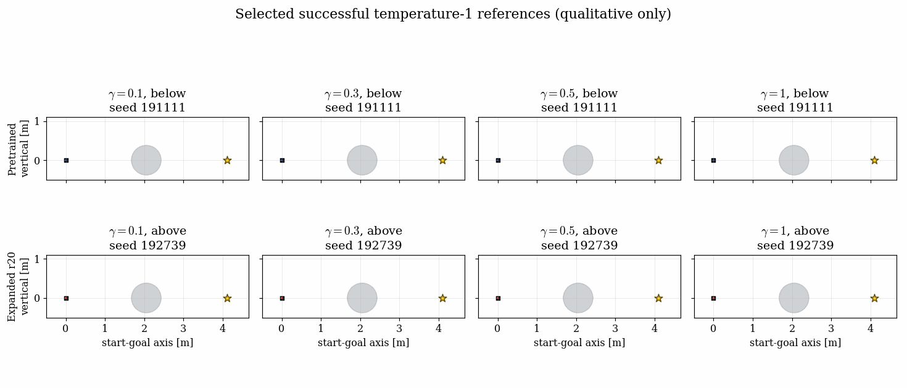
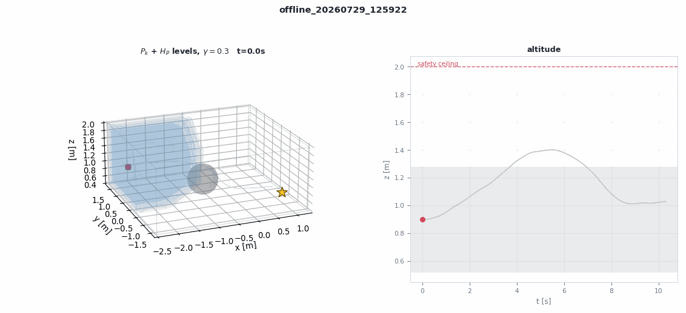

# Minhyuk handoff: pretrained and expanded lab flow policies

This directory contains the exact visual pretrained policy already used by the
lab pipeline and one experimental round-20 expanded policy. `raw10` remains an
authenticated baseline. All three use the same external governor/tracking
contract; `deploy_sim/` is unchanged.

| item | visual pretrained | expanded r20 | raw baseline |
|---|---|---|---|
| checkpoint | `pretrained_visual_hp3d.pt` | `expanded_visual_nozB5_r20.pt` | `pretrained_raw10.pt` |
| SHA-256 | `fc4d2158...6eb4` | `f7ce5e52...6b00` | `cdc27062...d059` |
| context | \([g-p,v,\gamma]\) + 3-D safety grid | same | \([g-p,v,b_{\rm near}-p,\gamma]\) |
| flow trunk | \(70\to48\to32\to30\), SiLU | same architecture | \(41\to48\to32\to30\), SiLU |
| output | raw \(H=10\), 3-D acceleration window | same | same |
| action limit | \(0.3\ {\rm m/s^2}\) per component | same | same |
| status | pretrained baseline | coverage-promising, not qualified | pretrained baseline |

The visual grid has shape \(3\times16\times12\times12\) with channels
`occupancy`, `nominal_polytope_mask`, and clipped \(H_P\). A compact Conv3D
encoder maps it to 32 dimensions. The grid is robot-centered and world-axis
aligned. It is rebuilt from the current position and the **known configured
map**; this is not an onboard-perception claim.

The policy predicts the pre-smoothing raw acceleration command. Minhyuk's
unchanged deployment harness owns smoothing, reference integration, geofence
checks, and vehicle interface. Do not duplicate those operations in the
policy. Sampling temperature means

\[
x_0\sim\mathcal N(0,\tau^2 I).
\]

## 1. Online state-feedback inference

```bash
python scripts/run_lab_flow_deployment.py \
  --checkpoint flow_deployment/minhyuk_handoff/pretrained_visual_hp3d.pt \
  --expected-checkpoint-sha256 \
    fc4d215817b56d74730a0a90f6abc57d17dbeb7626302add535760399cdeeeb4 \
  --sampling-temperature 1.0 \
  --gamma 0.3 \
  --seed 91000 \
  --output outputs/minhyuk_visual_online
```

For Minhyuk's hardware runner, instantiate the identical controller:

```python
from flow_deployment.lab_pretrained import load_lab_deployment_controller
from safe_mppi.config import load_config
from safe_mppi.environment import TaskEnvironment

cfg = load_config("configs/lab_ball_pretrain.json")
env = TaskEnvironment(cfg)
controller, contract = load_lab_deployment_controller(
    "flow_deployment/minhyuk_handoff/pretrained_visual_hp3d.pt",
    env,
    sampling_temperature=1.0,
    expected_sha256=(
        "fc4d215817b56d74730a0a90f6abc57d17dbeb7626302add535760399cdeeeb4"
    ),
)

# At every 10 Hz replan:
action, info = controller.plan(
    state=[px, py, pz, vx, vy, vz],
    goal=env.goal,
    gamma=0.3,
    seed=episode_seed * 100_000 + step,
)
```

`action` is acceleration feedforward, not a motor command. The present
`deploy_sim` harness supplies measured position \(p_{\rm meas}\) but its
reference velocity \(v_{\rm ref}\), not measured velocity, in this state.

The same command deploys the expanded checkpoint by replacing:

```bash
--checkpoint flow_deployment/minhyuk_handoff/expanded_visual_nozB5_r20.pt \
--expected-checkpoint-sha256 \
  f7ce5e52f4705deec924545b4cba16609e3e53ce045e9d628e34ee39b6e06b00
```

## 2. Frozen trajectory export

```bash
python scripts/export_lab_flow_frozen_references.py \
  --checkpoint flow_deployment/minhyuk_handoff/pretrained_visual_hp3d.pt \
  --expected-checkpoint-sha256 \
    fc4d215817b56d74730a0a90f6abc57d17dbeb7626302add535760399cdeeeb4 \
  --sampling-temperature 1.0 \
  --gammas 0.1 0.3 0.5 1.0 \
  --seeds 91000 \
  --output outputs/minhyuk_visual_frozen
```

Each NPZ contains `dense_positions`, `states`, raw `controls`, governed
`executed_controls`, and `dense_steps`.

## 3. Run the declared selected recipe

The portable pretrain directory is
`flow_deployment/minhyuk_handoff/expansion_pretrain`. Its checkpoint is
byte-identical to `pretrained_visual_hp3d.pt`; its manifest points to the
tracked 200-trajectory archive using a repository-relative path.

This is the recorded recipe ported to the current committed implementation.
The original sweep came from an uncommitted source state, so exact historical
source-byte reproduction is unavailable; see the provenance caveat in
`../../results/lab_ball_expansion/minhyuk_nozB5_r20/manifest.json`.

```bash
PRE=flow_deployment/minhyuk_handoff/expansion_pretrain
OUT=results/my_minhyuk_lab_expansion

python scripts/run_ball_expansion.py \
  --pretrain-dir "$PRE" \
  --output "$OUT" \
  --rounds 20 \
  --flow-base-std 1.25 \
  --learning-rate 1e-5 \
  --first-layer-lr-scale 0.1 \
  --beta 0.0005 \
  --adaptive-beta \
  --ess-target 0.1 \
  --parallel-episodes 12 \
  --verifier-workers 8 \
  --max-retry-batches 32 \
  --successful-trajectories-per-gamma 6 \
  --K 16 \
  --B 4 \
  --inner-steps 3 \
  --batch-size 64 \
  --replay-selector uniform \
  --replay-rounds 3 \
  --gp-buffer-cap 768 \
  --gp-reference-mode sliding_success_per_gamma_current_phi \
  --gp-sliding-row-selector trajectory_uniform \
  --candidate-perturb-std 0 \
  --candidate-perturb-scope coherent_horizon \
  --negative-alpha 0 \
  --archive-rule successful_executed_windows \
  --successful-trajectory-selector lowest_episode_id \
  --replay-acceptance execution_eligible \
  --execution-rule min_cost \
  --acquisition-feature learned_phi \
  --tight-corridor \
  --verifier-mode full_polytope \
  --event-log full \
  --seed 1
```

The selected sweep used `--event-log none`; `full` above changes only
diagnostic storage and allows the evaluator to render the acquisition video.

```bash
# Quick M=20/gamma evaluation.
python scripts/evaluate_ball_expansion.py \
  --pretrain-dir "$PRE" \
  --expansion "$OUT" \
  --episodes 20 \
  --probe-samples 16 \
  --stride 5 \
  --seed 91000 \
  --raw-tight-corridor \
  --video-gamma 0.5 \
  --video-rounds 1 5 10 15 20
```

For a fast metric/gallery pass without an event video, add
`--screening-only`. The compact original checkpoint endpoint pair and its disjoint
M=50 audit are in
`../../results/lab_ball_expansion/minhyuk_nozB5_r20/`.

For the exact disjoint headline audit of the supplied endpoint pair, use
`--episodes 50 --probe-samples 32 --stride 20 --seed 191000
--raw-tight-corridor --screening-only`.

Fresh expansion checkpoints contain model state but not the full architecture
contract. Package the selected round before giving it to the deployment
loader:

```bash
RAW="$OUT/checkpoint_020.pt"
RAW_SHA="$(shasum -a 256 "$RAW" | awk '{print $1}')"

python scripts/package_lab_flow_expansion.py \
  --pretrained "$PRE/pretrained.pt" \
  --expansion-checkpoint "$RAW" \
  --output "$OUT/deployable_checkpoint_020.pt" \
  --expected-pretrained-sha256 \
    fc4d215817b56d74730a0a90f6abc57d17dbeb7626302add535760399cdeeeb4 \
  --expected-expansion-sha256 "$RAW_SHA"

DEPLOY_SHA="$(shasum -a 256 "$OUT/deployable_checkpoint_020.pt" | awk '{print $1}')"
python scripts/run_lab_flow_deployment.py \
  --checkpoint "$OUT/deployable_checkpoint_020.pt" \
  --expected-checkpoint-sha256 "$DEPLOY_SHA" \
  --sampling-temperature 1.0 \
  --gamma 0.3 \
  --seed 192739 \
  --output "$OUT/deploy_smoke_g0p3_s192739"
```

## 4. Multiple deploy-sim rollouts

The following seed banks were independently rerun at all four \(\gamma\)
values with temperature 1.0. Every run reached the goal with positive residual
clearance in the unchanged native harness; exact durations, clearances, and
fence margins are recorded in `deployment_smoke_manifest.json`:

- pretrained visual: `91703`, `95440`;
- expanded r20: `191481`, `192739`.

Example for the expanded model:

```bash
for gamma in 0.1 0.3 0.5 1.0; do
  for seed in 191481 192739; do
    python scripts/run_lab_flow_deployment.py \
      --checkpoint \
        flow_deployment/minhyuk_handoff/expanded_visual_nozB5_r20.pt \
      --expected-checkpoint-sha256 \
        f7ce5e52f4705deec924545b4cba16609e3e53ce045e9d628e34ee39b6e06b00 \
      --sampling-temperature 1.0 \
      --gamma "$gamma" \
      --seed "$seed" \
      --output "outputs/expanded_g${gamma}_s${seed}" \
      --gif
  done
done
```

Use the same loop with `pretrained_visual_hp3d.pt`, its SHA, and seeds
`91703 95440` for the pretrained comparison. Automation must
inspect the generated `deployment_contract.json`; the process exit code alone
does not mean the vehicle reached the goal. The conservative smoke gate is

```text
metrics.reached == true
metrics.clearance_beyond_safety_sphere_m >= 0.052
metrics.fence_margin_m > 0
```

The \(52\) mm allowance is the recorded worst-case tracking residual, not a
formal safety margin.

Qualitative artifacts:

- `pretrained_vs_expanded_selected_successes_short.gif`: selected successful
  temperature-1 references; pretrained below versus expanded above, all gamma;
- `pretrained_deploy_sim_g0p3_s95440.gif`: native pretrained deployment smoke;
- `expanded_deploy_sim_g0p3_s192739.gif`: native expanded deployment smoke.

These GIFs are curated successful examples, not evaluation statistics.



| pretrained native smoke | expanded native smoke |
|---|---|
|  |  |

## Qualification and limits

Both models were audited using the same raw temperature-1 \(M=50/\gamma\)
protocol. The visual model's pooled SR is 51% versus 44% for raw10, and pooled
OOB is 17% versus 29%. Its pooled CR is worse, 32% versus 27%, driven by
\(\gamma=1\) (48% CR). It discovered no above route in this audit. Exact
per-\(\gamma\) values are in `pretrain_visual_manifest.json` and
`pretrain_manifest.json`.

The expanded r20 raw temperature-1 disjoint \(M=50/\gamma\) audit is not a
win: SR \(0.20\), CR \(0.505\), OOB \(0.295\), and window validity \(0.838\).
It changed successful route counts from pretrained
`below/above/left/right = 87/0/16/14` to `0/23/1/16`. Thus it demonstrates
above-route discovery while also demonstrating catastrophic forgetting and
lower task completion. Do not choose it as a general safety/performance winner.

All deployment examples are reproducibility and software-interface checks—not
flight safety certificates. Neither checkpoint has an online verifier
guarantee, onboard map estimator, or hardware tracking guarantee.
