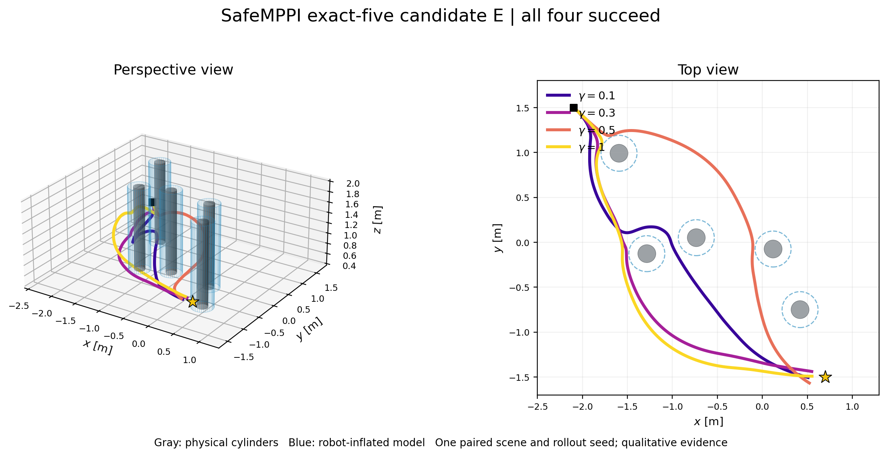
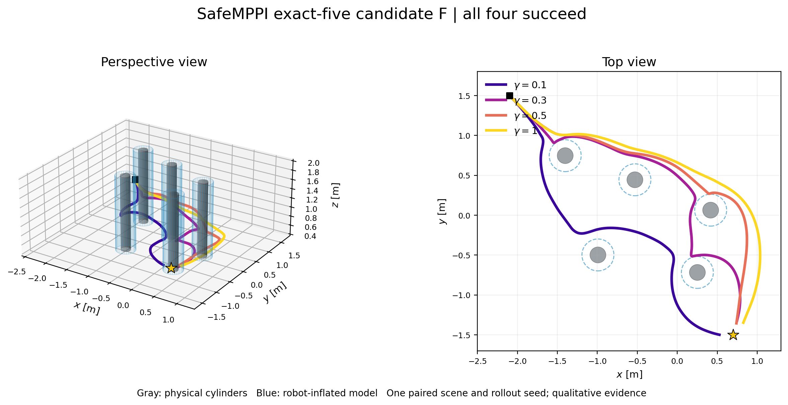
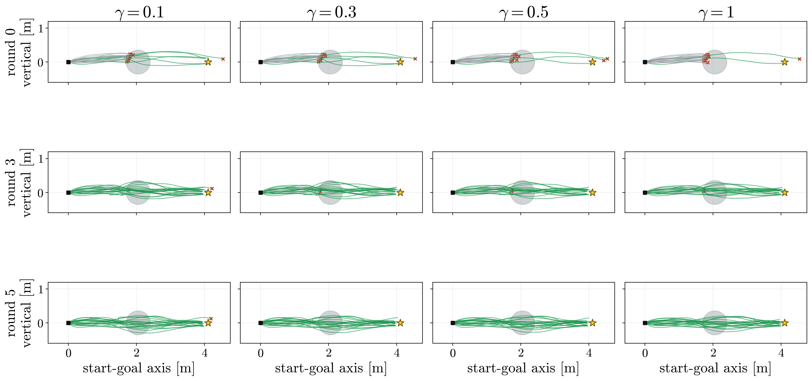
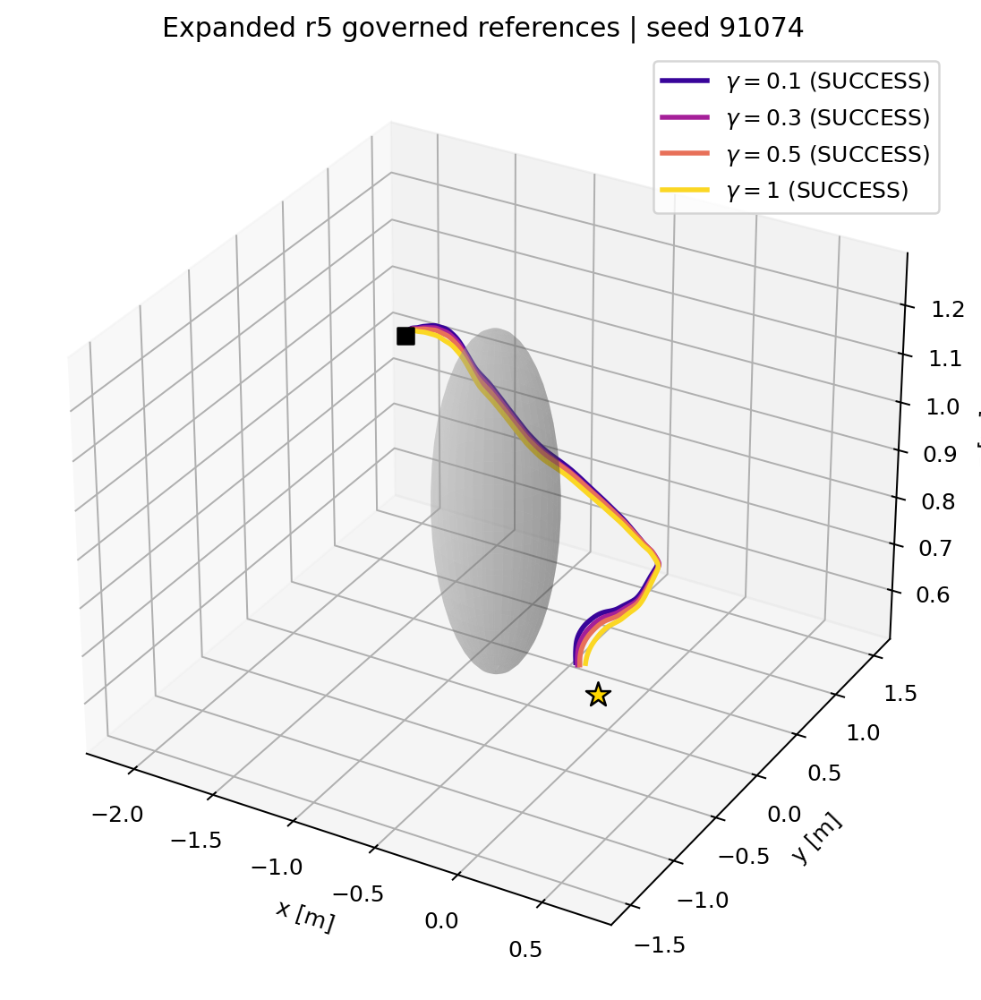
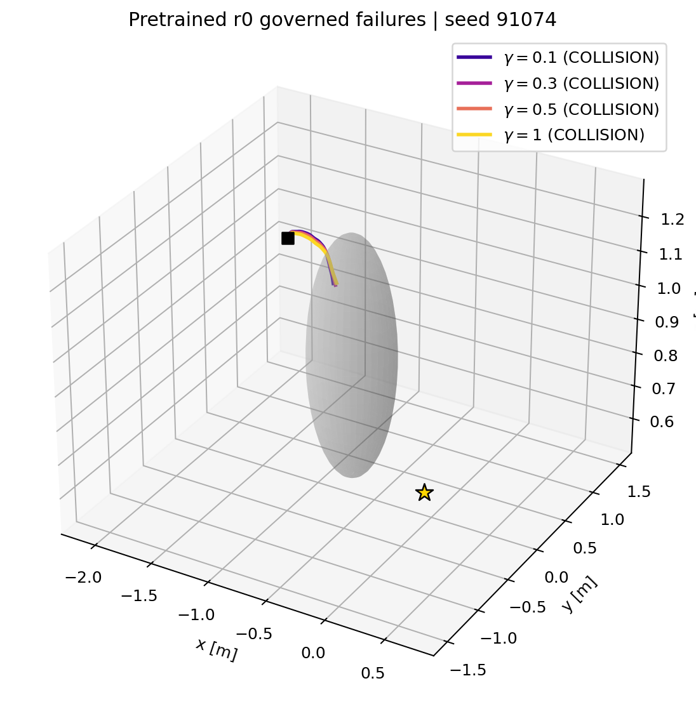
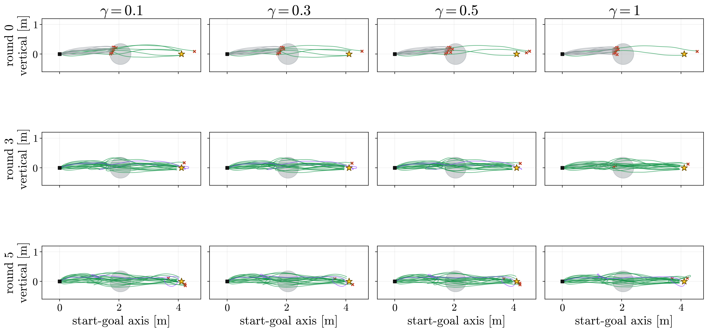
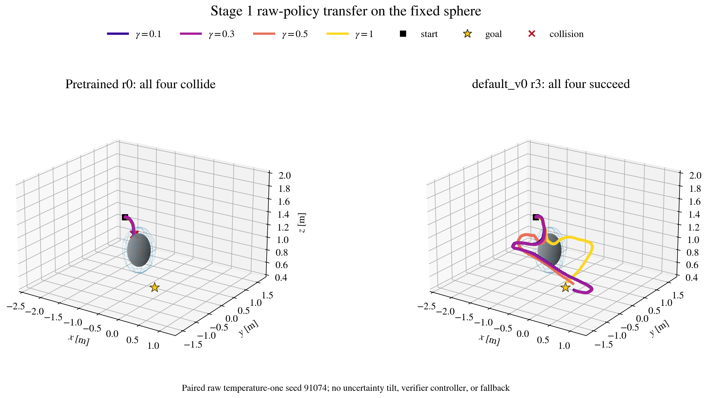
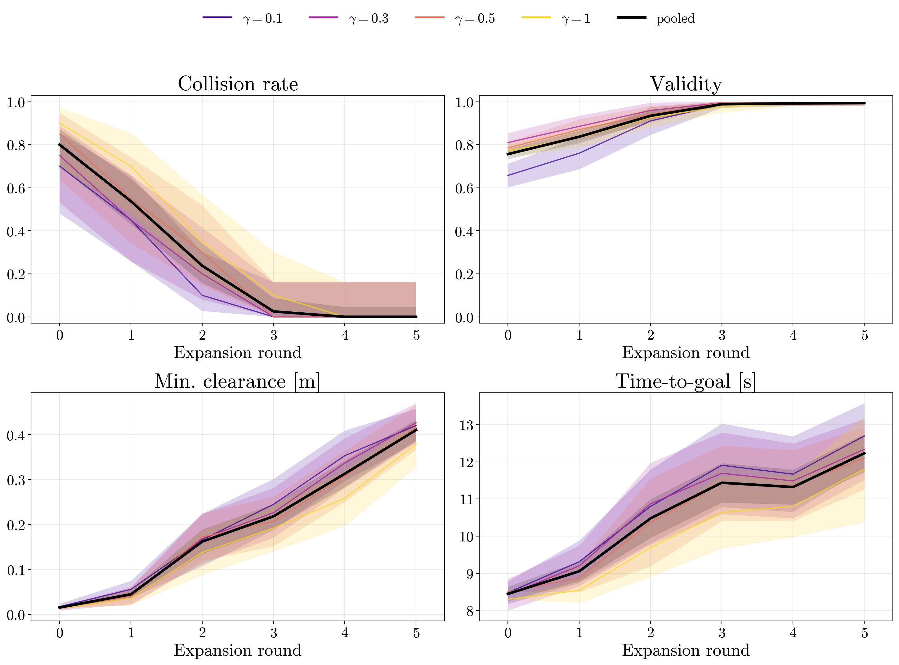

# Minhyuk handoff: HP100-T128-D3 and Stage-1 single-sphere expansion

This folder is the 2026-08-01 pretrained-policy handoff. It sits on top of
Minhyuk and Claude's trajectory-following commit
`5bcd05d197eb46ef9282c12b83291ae19a2ea928`. No executable file under
`deploy_sim/` was changed by this integration.

The handoff contains the cylinder-ID pretrained policy and two completed
five-round fixed-sphere expansions. `lamd7e4` is the current Stage-1 result;
only its terminal round-5 checkpoint is packaged. The earlier `default_v0`
screen remains below as historical evidence. Neither is a flight-safety
guarantee. Randomized multi-sphere expansion remains active Stage-2 work and
is not part of this handoff yet.

## What to use

| item | file / contract |
|---|---|
| pretrained checkpoint | [`checkpoints/hp100_t128_d3.pt`](checkpoints/hp100_t128_d3.pt) |
| checkpoint SHA-256 | `cc87b65f27506254509b7f4cbbe4734aacfc9e50640a3756cfb0b1ed456e28ff` |
| **current deployment checkpoint** | [`checkpoints/stage1_lamd7e4_terminal_r5.pt`](checkpoints/stage1_lamd7e4_terminal_r5.pt), SHA-256 `115a50e38b9f1c52819649663853d0699568bd07a00df3f4c6ef899262243d99` |
| raw final expansion state | [`default_v0_mppicost_lamd7e4/checkpoint_005.pt`](default_v0_mppicost_lamd7e4/checkpoint_005.pt), SHA-256 `81d73de001b2080387459a72436069f8b39dc44788ea43c50f732d637f6630cc` |
| current run and evaluation | [`default_v0_mppicost_lamd7e4/README.md`](default_v0_mppicost_lamd7e4/README.md) |
| previous selected checkpoint | [`checkpoints/stage1_default_v0_best_r3.pt`](checkpoints/stage1_default_v0_best_r3.pt), SHA-256 `dfa4b72a...fd69c` |
| previous terminal checkpoint | [`checkpoints/stage1_default_v0_terminal_r5.pt`](checkpoints/stage1_default_v0_terminal_r5.pt), SHA-256 `e58b81e0...84ed4` |
| expansion and evaluation contract | [`expanded_default_v0_contract.json`](expanded_default_v0_contract.json) |
| exact raw M=20/gamma metrics | [`default_v0/raw_eval_m20.json`](default_v0/raw_eval_m20.json) |
| architecture and command contract | [`model_contract.json`](model_contract.json) |
| pretraining provenance | [`checkpoints/pretrain_manifest.json`](checkpoints/pretrain_manifest.json) |
| independent M=100/gamma audit | [`checkpoints/pretrain_audit_m100.json`](checkpoints/pretrain_audit_m100.json) |
| figure and trajectory provenance | [`asset_manifest.json`](asset_manifest.json) |
| all delivered file hashes | [`SHA256SUMS`](SHA256SUMS) |

The model predicts an `H=10` sequence of raw accelerations. Its context is
`[goal-position, velocity, gamma]` plus a 128-dimensional token from a
robot-centered `1 x 32 x 32 x 100` clipped-`H_P` volume. It has no internal
stateful governor and no past-action GRU. Deployment smoothing, measured-state
feedback, command interpolation, and platform limits remain the responsibility
of Minhyuk's native deployment loop and must be applied exactly once.

The canonical loader is `safe_mppi.lab_visual_flow.load_lab_reference_policy`.
`flow_deployment.lab_pretrained.load_lab_pretrained_policy` delegates to that
loader so the old and HP100 checkpoint schemas share one deployment entry
point.

## Authoritative task configurations

All tasks use the lab geofence
`x in [-2.5,1.3], y in [-1.7,1.8], z in [0.4,2.0]`, start
`(-2.1,1.5,0.9)`, goal `(0.7,-1.5,0.9)`, reach radius `0.2 m`, and the same
`H=10`, `dt=0.1 s`, `0.3 m/s^2` SafeMPPI command cap.

| stage | authoritative config | obstacle law |
|---|---|---|
| cylinder ID / pretraining | [`../../configs/lab_clutter_cylinders_path_midpoint_uniform_v2.json`](../../configs/lab_clutter_cylinders_path_midpoint_uniform_v2.json) | 4--8 vertical cylinders; physical radius 0.10 m plus 0.10 m robot inflation |
| physical lab cylinder evidence | [`../../configs/lab_clutter_cylinders_lab_five_v2.json`](../../configs/lab_clutter_cylinders_lab_five_v2.json) | exactly 5 vertical cylinders, matching the available lab inventory |
| randomized sphere OOD | [`../../configs/lab_clutter_spheres_path_midpoint_uniform_v2.json`](../../configs/lab_clutter_spheres_path_midpoint_uniform_v2.json) | 3--6 spheres; physical radius 0.254 m plus 0.10 m robot inflation |
| Stage-2 canonical three-sphere screen | [`../minhyuk_clutter_handoff/canonical_three_sphere_config.json`](../minhyuk_clutter_handoff/canonical_three_sphere_config.json) | fixed original 0.70 m equilateral triangle of three 15-inch spheres |
| Stage 1 | [`../../configs/lab_ball_stage1_t128.json`](../../configs/lab_ball_stage1_t128.json) | one fixed modeled sphere at `(-0.7,0,0.9)`, radius 0.354 m |

The ID and OOD randomizers admit geometry without conditioning on expert
success. They use no extra obstacle-to-obstacle or wall gap beyond the modeled
bodies. SafeMPPI uses 512 proposals, temperature 0.02, isotropic noise
`(0.5,0.5,0.5)`, no centroid steering, no anisotropic proposal, no z bias, and
no soft-clearance cost.

## Reproducible trajectory evidence

### Cylinder ID: SafeMPPI expert

The lab inventory is exactly five cylinders. We package two branch-rich
paired-seed candidates so the tracking team can choose between concrete
successful references rather than relying on one curated route.

| candidate E | candidate F |
|---|---|
|  |  |

| candidate | scene / common rollout seed | distinct route signatures | cross-gamma spread | minimum clearance |
|---|---|---:|---:|---:|
| E | `cylinders_00317` / `729853` | 3 | 0.675 m | 0.013 m |
| F | `cylinders_01652` / `2076868` | 3 | 0.589 m | 0.007 m |

All eight gamma rollouts are genuine terminal SafeMPPI successes. The physical
cylinder is gray and the dashed blue outline is the robot-inflated model. The
large route separation is the reason these candidates were selected; the tight
reported clearances mean they remain qualitative tracking evidence, not a
flight-safety certificate or a success-rate estimate.

The source archives are
`trajectory_archives/run_g*_cylinders_00317_s729853.npz` and
`trajectory_archives/run_g*_cylinders_01652_s2076868.npz`. Each archive stores
the actual evolving `poly_A/poly_b`. Candidate-scoped GIFs in `assets/` replay
that BLUE nominal polytope and its ten gamma-dependent horizon level sets.

The checkpoint's training provenance remains the original randomized `4--8`
cylinder distribution. The exact-five config and E/F scenes are deployment
evidence only; they do not rewrite how the checkpoint was trained.

### Stage 1 current result: `lamd7e4`

`lamd7e4` keeps the same fixed single-sphere OOD task and raw temperature-one
evaluation bank as `default_v0`. It uses `min_cost` execution with
`J_native - 70000 * first_step_nominal_H_P_margin`; the configured proximity
cost remains zero. Only the final expanded model is shipped.

| checkpoint | SR | CR | OOB | Validity | successful clearance | time-to-goal |
|---|---:|---:|---:|---:|---:|---:|
| pretrained r0 | 13.75% | 80.0% | 6.25% | 75.64% | 0.0155 m | 8.45 s |
| **expanded r5** | **98.75%** | **0%** | 1.25% | **99.77%** | **0.3882 m** | 10.23 s |

These are the same raw temperature-one `M=20/gamma` policy rollouts at every
checkpoint: no uncertainty tilt, verifier controller, fallback, or curated
seed selection enters the aggregate. The result is not yet a coverage win:
all 79 r5 successes use the left route, so route coverage is only `1/4`.



The exact metrics, curves, mechanism video, manifests, and governed reference
arrays are under
[`default_v0_mppicost_lamd7e4/`](default_v0_mppicost_lamd7e4/).

#### Paired deployment references

Seed `91074` is an exact paired example for all four safety levels. The
pretrained policy collides at every gamma; the r5 policy succeeds at every
gamma with window validity `1.0`. Each NPZ contains dense positions, 10 Hz
states, raw controls, and the already-governed executed controls. Do not apply
the governor or smoothing a second time.

| policy | gamma | outcome | route | clearance | time |
|---|---:|---|---|---:|---:|
| pretrained r0 | .1/.3/.5/1.0 | collision at all four | none | negative | -- |
| expanded r5 | .1 | success | left | .3411 m | 11.4 s |
| expanded r5 | .3 | success | left | .3196 m | 11.3 s |
| expanded r5 | .5 | success | left | .3013 m | 11.2 s |
| expanded r5 | 1.0 | success | left | .2611 m | 11.0 s |





The requested four-way successful reference set does **not** exist in this
terminal model. A supplemental CPU search over 100 new temperature-one seeds
per gamma found `395/400` successes, all left. A gamma-.3 diagnostic over
sampling temperatures `.5, 1.5, 2, 3, 4, 5` likewise found no successful
non-left route. The exact bounded-search counts are in
[`reference_search_audit.json`](default_v0_mppicost_lamd7e4/references/reference_search_audit.json).
This is why the handoff supplies the honest paired left-route references rather
than relabeling visually different left paths as four homotopies.

### Stage 1: pretrained raw policy before expansion


This is the uncurated raw temperature-one evaluation with `M=20/gamma`, seed
bank `91000 + 37 * episode`, no uncertainty tilt, no verifier controller, and
no fallback. The exact aggregate is:

| metric | pooled value |
|---|---:|
| SR | 13.75% |
| CR | 80.00% |
| OOB | 6.25% |

Per-gamma SR is `25/20/5/5%` for gamma `0.1/0.3/0.5/1.0`. The dominant
in-plane behavior and visible collisions are the declared Stage-1 baseline.
Seed `91000` happens to succeed at all four gammas; those four exact raw
reference archives are packaged as
`trajectory_archives/stage1_single_sphere_raw_g*_s91000_success.npz` so the
deployment team can reproduce or track a concrete candidate. This selected
seed is not representative of the aggregate rate.

### Stage 1: `default_v0` after expansion

The evaluator reloaded every saved checkpoint and replayed the **same** raw
temperature-one `M=20/gamma` bank (`91000 + 37 * episode`). These are policy
metrics—not sigma-tilted gathering trajectories—and use no verifier controller
or fallback.

| checkpoint | SR | CR | OOB | Validity | successful clearance | time-to-goal | route coverage |
|---|---:|---:|---:|---:|---:|---:|---:|
| pretrained r0 | 13.75% | 80.0% | 6.25% | 75.64% | 0.0155 m | 8.45 s | 1/4 |
| **r3, best screened SR** | **92.5%** | **2.5%** | 5.0% | **98.87%** | 0.2185 m | 11.44 s | 2/4 |
| r5, terminal | 87.5% | **0%** | 7.5% | 99.37% | **0.4106 m** | 12.23 s | 1/4 |



The next overlay is a qualitative paired example from the declared bank:
episode 2 (`seed=91074`) collides at all four gammas under r0 and succeeds at
all four under r3. The low-gamma paths are slower and have larger clearance;
gamma 1 takes the other in-plane homotopy. Its eight exact trajectories are in
`trajectory_archives/stage1_default_v0_r{0,3}_g*_s91074_*.npz`.





This is a strong Stage-1 success/safety result, but not a full coverage result.
At r3, successful routes are left/right `68/6` with no above/below success. At
r5, all 70 successes use the left route. Round 3 was selected on the same M=20
screen rather than a disjoint confirmation, so it remains an experimental
handoff checkpoint.

### Stage 2 baseline

The current canonical three-sphere task and its independent raw
`M=50/gamma` pretrained baseline are now documented in
[`../minhyuk_clutter_handoff/`](../minhyuk_clutter_handoff/). Its pooled raw
temperature-one result is `SR=48.5%`, `CR=49.5%`, and `OOB=2.0%`. Stage-2
expansion is still in progress; no provisional expanded checkpoint is shipped.

Revalidate and rebuild the exact-five E/F evidence without rerunning the raw
policy screens:

```bash
python scripts/build_minhyuk_stage1_handoff_assets.py \
  --device cpu --cylinder-only
```

The builder fails if the Stage-1 aggregate differs from
`SR=.1375, CR=.80, OOB=.0625`. Two independent clean reruns produced identical
manifests and generated-file hashes.

## Native Stage-1 deployment entry points

From the repository root:

```bash
CFG=configs/lab_ball_stage1_t128.json
CKPT=flow_deployment/minhyuk_stage1_handoff/checkpoints/stage1_lamd7e4_terminal_r5.pt
CKPT_SHA=115a50e38b9f1c52819649663853d0699568bd07a00df3f4c6ef899262243d99
CFG_SHA=31e64eeb9dd9a4fa00f738340ef36035517044c78e62b5e0ec45cb3e92a2fc38

# Closed-loop software integration through Minhyuk's unchanged harness.
python scripts/run_lab_flow_deployment.py \
  --config "$CFG" \
  --checkpoint "$CKPT" \
  --expected-checkpoint-sha256 "$CKPT_SHA" \
  --expected-config-sha256 "$CFG_SHA" \
  --sampling-temperature 1 \
  --gamma 0.3 \
  --seed 91074 \
  --device cpu \
  --output outputs/minhyuk_stage1_lamd7e4_online_g03_s91074

# Deterministic frozen references for the four gammas.
python scripts/export_lab_flow_frozen_references.py \
  --config "$CFG" \
  --checkpoint "$CKPT" \
  --expected-checkpoint-sha256 "$CKPT_SHA" \
  --expected-config-sha256 "$CFG_SHA" \
  --sampling-temperature 1 \
  --gammas 0.1 0.3 0.5 1.0 \
  --seeds 91074 \
  --device cpu \
  --title "Stage 1 expanded r5 references" \
  --output outputs/minhyuk_stage1_lamd7e4_frozen_s91074
```

The frozen exporter applies the repository `ReferenceGovernor` once and stores
both raw controls and governed executed controls. The online runner instead
rebuilds the visual context from measured state and the configured obstacle map
at every replan, then passes commands through the unchanged native harness.
The visual volume is built from the known configured map; it is not an onboard
perception system.

Seed `91074` is the authenticated paired handoff: pretrained r0 collides for
all four gammas, while expanded r5 succeeds for all four with validity `1.0`.
Those four expanded paths are all the same left route, so this is a
success/safety result rather than a coverage result. Minhyuk should first
replay the frozen references, then validate measured-state closed-loop
clearance in the native simulator.

For a pretrained comparison, set `CKPT` to
`flow_deployment/minhyuk_stage1_handoff/checkpoints/hp100_t128_d3.pt` and
`CKPT_SHA` to
`cc87b65f27506254509b7f4cbbe4734aacfc9e50640a3756cfb0b1ed456e28ff`.
The exact lambda7e4 research recipe, raw gallery, curves, metrics, and final
raw expansion checkpoint remain under
[`default_v0_mppicost_lamd7e4/`](default_v0_mppicost_lamd7e4/).
