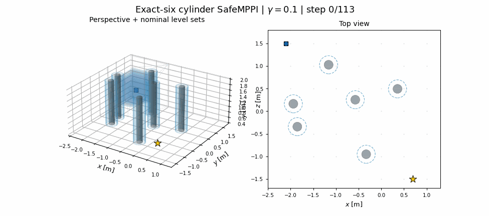
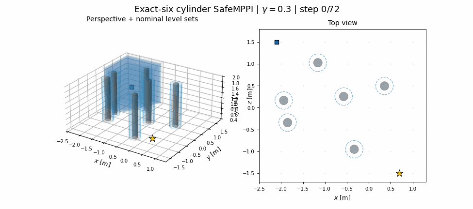
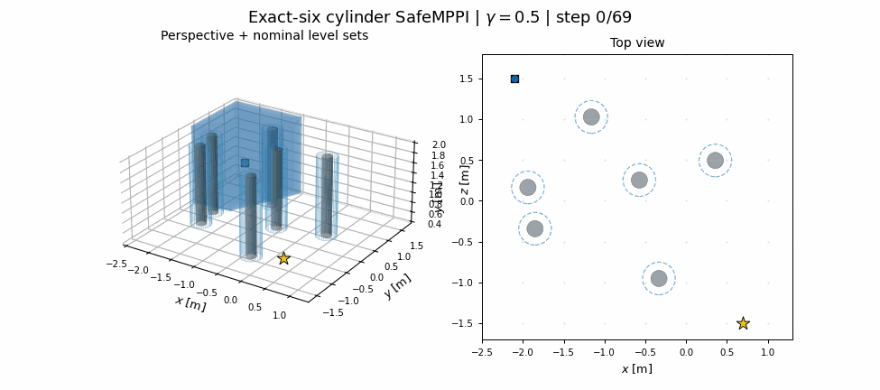
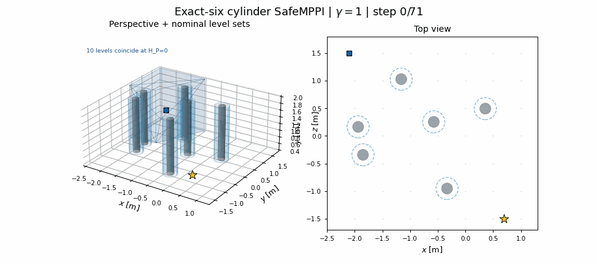
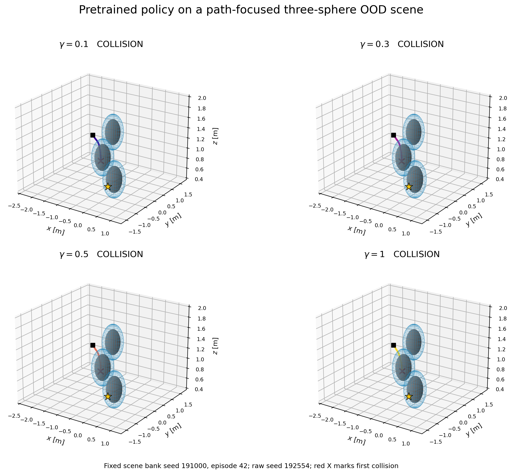

# Minhyuk handoff: HP100-T128-D3 pretraining and Stage 1

This folder is the 2026-08-01 pretrained-policy handoff. It sits on top of
Minhyuk and Claude's trajectory-following commit
`5bcd05d197eb46ef9282c12b83291ae19a2ea928`. No executable file under
`deploy_sim/` was changed by this integration.

The handoff contains the cylinder-ID policy and reproducible evidence only.
It does **not** contain a promoted expanded checkpoint and does not claim a
flight-safety guarantee. Stage 1 expansion uses one fixed midpoint sphere;
randomized multi-sphere expansion is Stage 2.

## What to use

| item | file / contract |
|---|---|
| pretrained checkpoint | [`checkpoints/hp100_t128_d3.pt`](checkpoints/hp100_t128_d3.pt) |
| checkpoint SHA-256 | `cc87b65f27506254509b7f4cbbe4734aacfc9e50640a3756cfb0b1ed456e28ff` |
| architecture and command contract | [`model_contract.json`](model_contract.json) |
| pretraining provenance | [`checkpoints/pretrain_manifest.json`](checkpoints/pretrain_manifest.json) |
| independent M=100/gamma audit | [`checkpoints/pretrain_audit_m100.json`](checkpoints/pretrain_audit_m100.json) |
| figure and trajectory provenance | [`asset_manifest.json`](asset_manifest.json) |
| all delivered file hashes | [`SHA256SUMS`](SHA256SUMS) |

The model predicts an `H=10` sequence of raw accelerations. Its context is
`[goal-position, velocity, gamma]` plus a 128-dimensional token from a
robot-centered `1 x 32 x 32 x 100` clipped-`H_P` volume. It has no internal
stateful governor and no past-action GRU. Deployment smoothing, measured-state
feedback, command interpolation, and platform limits remain the responsibility
of Minhyuk's native deployment loop and must be applied exactly once.

The canonical loader is `safe_mppi.lab_visual_flow.load_lab_reference_policy`.
`flow_deployment.lab_pretrained.load_lab_pretrained_policy` delegates to that
loader so the old and HP100 checkpoint schemas share one deployment entry
point.

## Authoritative task configurations

All tasks use the lab geofence
`x in [-2.5,1.3], y in [-1.7,1.8], z in [0.4,2.0]`, start
`(-2.1,1.5,0.9)`, goal `(0.7,-1.5,0.9)`, reach radius `0.2 m`, and the same
`H=10`, `dt=0.1 s`, `0.3 m/s^2` SafeMPPI command cap.

| stage | authoritative config | obstacle law |
|---|---|---|
| cylinder ID / pretraining | [`../../configs/lab_clutter_cylinders_path_midpoint_uniform_v2.json`](../../configs/lab_clutter_cylinders_path_midpoint_uniform_v2.json) | 4--8 vertical cylinders; physical radius 0.10 m plus 0.10 m robot inflation |
| physical lab cylinder evidence | [`../../configs/lab_clutter_cylinders_lab_six_v2.json`](../../configs/lab_clutter_cylinders_lab_six_v2.json) | exactly 6 vertical cylinders, matching the available lab inventory |
| randomized sphere OOD | [`../../configs/lab_clutter_spheres_path_midpoint_uniform_v2.json`](../../configs/lab_clutter_spheres_path_midpoint_uniform_v2.json) | 3--6 spheres; physical radius 0.254 m plus 0.10 m robot inflation |
| fixed three-sphere OOD screen | [`../../configs/lab_clutter_spheres_stage2_three_v2.json`](../../configs/lab_clutter_spheres_stage2_three_v2.json) | exactly three spheres from the same OOD law |
| Stage 1 | [`../../configs/lab_ball_stage1_t128.json`](../../configs/lab_ball_stage1_t128.json) | one fixed modeled sphere at `(-0.7,0,0.9)`, radius 0.354 m |

The ID and OOD randomizers admit geometry without conditioning on expert
success. They use no extra obstacle-to-obstacle or wall gap beyond the modeled
bodies. SafeMPPI uses 512 proposals, temperature 0.02, isotropic noise
`(0.5,0.5,0.5)`, no centroid steering, no anisotropic proposal, no z bias, and
no soft-clearance cost.

## Reproducible trajectory evidence

### Cylinder ID: SafeMPPI expert


This is one fixed **exact-six-cylinder**, paired-seed qualitative scene, not a
success-rate estimate. It was selected from 144 exact-six scenes for a clear
low-vs-high safety/feasibility contrast. All four gamma rollouts are genuine
SafeMPPI successes from scene `cylinders_00697`, common rollout seed `1113273`.
The horizontal RMS detour decreases from `0.2258 m` at gamma `0.1` to
`0.0893 m` at gamma `1.0`; time-to-goal changes from `11.3 s` to `7.1 s`.
The 1x2 figure shows the same trajectories in perspective and top view. The
exact archives are the four
`trajectory_archives/run_g*_cylinders_00697_s1113273.npz` files. Gray surfaces
are physical cylinders and blue outlines are robot-inflated models.

Each animation below uses the archive's actual evolving `poly_A/poly_b` at the
executed state. The BLUE volume is the nominal polytope and the nested BLUE
sets are its ten gamma-dependent horizon level sets.

| gamma 0.1 | gamma 0.3 |
|---|---|
|  |  |
| gamma 0.5 | gamma 1.0 |
|  |  |

The checkpoint's training provenance remains the original randomized `4--8`
cylinder distribution. The exact-six config and selected scene are deployment
evidence only; they do not rewrite how the checkpoint was trained.
The selected scene was a six-cylinder member of that original bank, so its four
packaged NPZ archives—not a fresh draw from the exact-six config—are the
authoritative fixed-scene replay.

### Stage 1: pretrained raw policy before expansion


This is the uncurated raw temperature-one evaluation with `M=20/gamma`, seed
bank `91000 + 37 * episode`, no uncertainty tilt, no verifier controller, and
no fallback. The exact aggregate is:

| metric | pooled value |
|---|---:|
| SR | 13.75% |
| CR | 80.00% |
| OOB | 6.25% |

Per-gamma SR is `25/20/5/5%` for gamma `0.1/0.3/0.5/1.0`. The dominant
in-plane behavior and visible collisions are the declared Stage-1 baseline.
Seed `91000` happens to succeed at all four gammas; those four exact raw
reference archives are packaged as
`trajectory_archives/stage1_single_sphere_raw_g*_s91000_success.npz` so the
deployment team can reproduce or track a concrete candidate. This selected
seed is not representative of the aggregate rate.

### Stage 2 preview: fixed three-sphere OOD failure



The concrete scene is generated from scene-bank seed `191000`, episode `42`,
and has SHA-256-like scene identity
`82eb7361927f8d076a6a7fc7a3f52e17f4ff9d203b4af49ca532ceffa2afd0c3`.
With raw seed `192554`, every gamma collides. The scene JSON and all four exact
trajectory archives are in `trajectory_archives/`.

Rebuild all figures and archives without editing source:

```bash
python scripts/build_minhyuk_stage1_handoff_assets.py --device cpu
```

The builder fails if the Stage-1 aggregate differs from
`SR=.1375, CR=.80, OOB=.0625`. Two independent clean reruns produced identical
manifests and generated-file hashes.

## Native deployment entry points

From the repository root:

```bash
CFG=configs/lab_ball_stage1_t128.json
CKPT=flow_deployment/minhyuk_stage1_handoff/checkpoints/hp100_t128_d3.pt
CKPT_SHA=cc87b65f27506254509b7f4cbbe4734aacfc9e50640a3756cfb0b1ed456e28ff
CFG_SHA=31e64eeb9dd9a4fa00f738340ef36035517044c78e62b5e0ec45cb3e92a2fc38

# Closed-loop software integration through Minhyuk's unchanged harness.
python scripts/run_lab_flow_deployment.py \
  --config "$CFG" \
  --checkpoint "$CKPT" \
  --expected-checkpoint-sha256 "$CKPT_SHA" \
  --expected-config-sha256 "$CFG_SHA" \
  --sampling-temperature 1 \
  --gamma 0.3 \
  --seed 91000 \
  --device cpu \
  --output outputs/minhyuk_hp100_online_g03_s91000

# Deterministic frozen references for the four gammas.
python scripts/export_lab_flow_frozen_references.py \
  --config "$CFG" \
  --checkpoint "$CKPT" \
  --expected-checkpoint-sha256 "$CKPT_SHA" \
  --expected-config-sha256 "$CFG_SHA" \
  --sampling-temperature 1 \
  --gammas 0.1 0.3 0.5 1.0 \
  --seeds 91000 \
  --device cpu \
  --output outputs/minhyuk_hp100_frozen_s91000
```

The frozen exporter applies the repository `ReferenceGovernor` once and stores
both raw controls and governed executed controls. The online runner instead
rebuilds the visual context from measured state and the configured obstacle map
at every replan, then passes commands through the unchanged native harness.
The visual volume is built from the known configured map; it is not an onboard
perception system.

The selected raw seed has only about `0.013--0.025 m` clearance beyond the
modeled Stage-1 sphere, and an integration smoke reached the goal while losing
that modeled clearance. Treat it as an interface/tracking candidate, not as a
flight-ready safety certificate. Minhyuk should first replay the frozen
reference and then validate closed-loop clearance in the native simulator.

## Today's expansion scope

The research-side source is
[`../../scripts/run_ball_expansion.py`](../../scripts/run_ball_expansion.py)
plus
[`../../scripts/evaluate_ball_expansion.py`](../../scripts/evaluate_ball_expansion.py).
The current local pretraining bundle is
`results/stage1_single_ball_t128/pretrain_hp100_t128_d3_e52`. It is intentionally
not duplicated here because expansion also needs the original demo/calibration
artifacts referenced by its manifest.

```bash
PRE=results/stage1_single_ball_t128/pretrain_hp100_t128_d3_e52
OUT=results/stage1_single_ball_t128/<new-expansion-run>

python scripts/run_ball_expansion.py \
  --pretrain-dir "$PRE" \
  --output "$OUT" \
  <frozen Stage-1 expansion recipe>

python scripts/evaluate_ball_expansion.py \
  --pretrain-dir "$PRE" \
  --expansion "$OUT" \
  --episodes 20 \
  --probe-samples 16 \
  --stride 1 \
  --seed 91000 \
  --raw-tight-corridor \
  --video-gamma 0.5
```

No expanded checkpoint is promoted by this handoff. It will be added only
after the fixed single-sphere policy improves raw SR, collision rate, validity,
clearance, and route coverage under a fixed evaluation bank. Randomized sphere
expansion follows only after that Stage-1 qualification.
