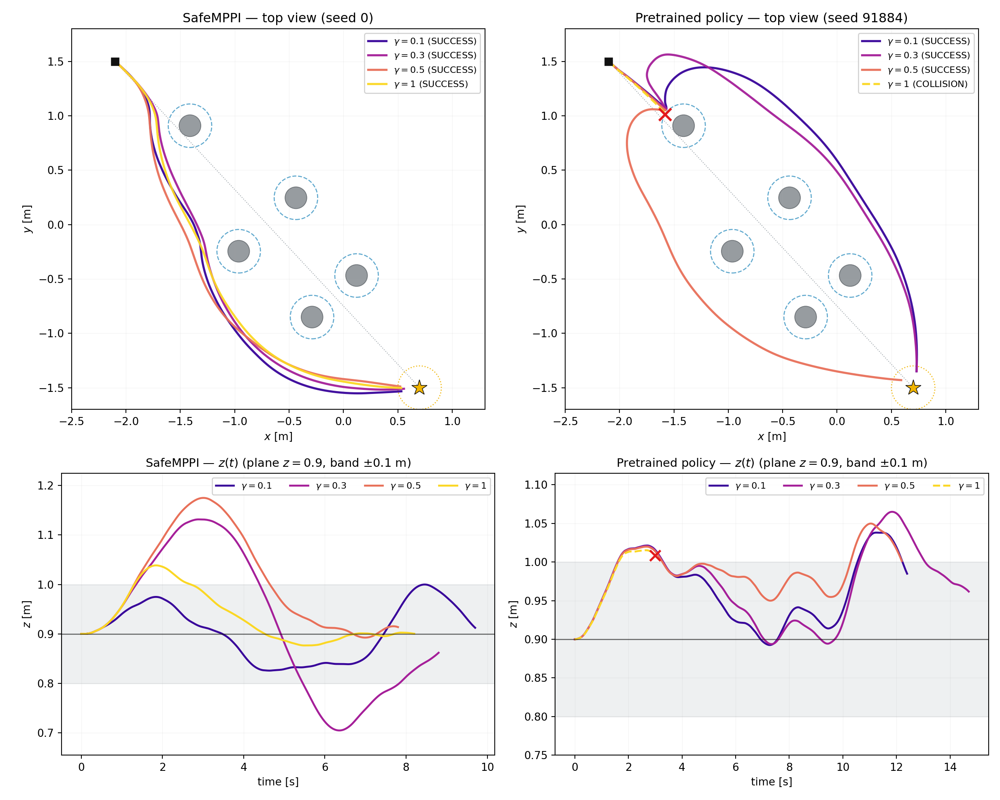
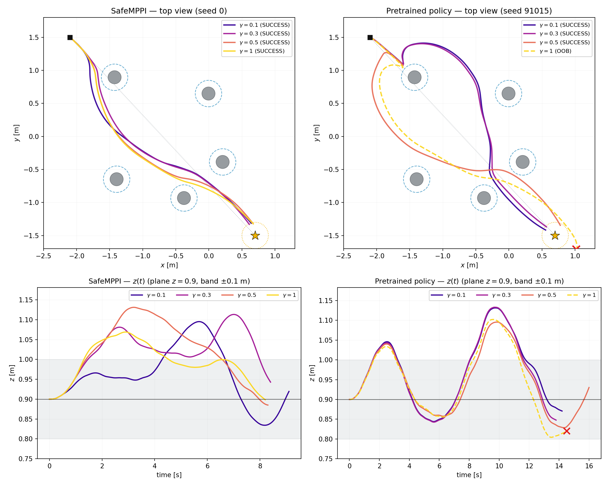

# 2026-08-06 paper-ready flight demonstration

Status: **FROZEN_INPUTS_READY**. The final inputs are two hand-designed
symmetric five-cylinder layouts, `symmetric_scene_outer` and
`symmetric_scene_inner`. They replace the earlier three-random-scene/A-B-C
plan. Minhyuk and Claude must not modify shared files or frozen trajectories.

Previous hardware evidence is stored in the
[Drive campaign](https://drive.google.com/drive/u/1/folders/1EjEM4SaClhyBJ4mKbveiexoWvCKFV8vn).
It is context rather than authenticated source provenance because those logs
did not record the repository Git SHA.

## Objective and matrix

Fly the frozen SafeMPPI and cylinder-ID pretrained-policy trajectories at
`gamma = 0.1, 0.3, 0.5, 1.0` in both final layouts:

`2 scenes x 2 policies x 4 gammas = 16 trajectory cells`.

The frozen bundle is
[`inputs/0806_flight_demonstration_suite/`](inputs/0806_flight_demonstration_suite/).
Its README explains the simulation outcomes, exact sources, 100 Hz playback
contract, camera calibration and sim/real rendering workflow.

These are curated paper demonstrations, not an unbiased SR evaluation. The
layouts were constructed directly and were not produced by the randomized
path-focused scene generator.

## Today's target trajectories

Each figure overlays the four frozen `gamma = 0.1, 0.3, 0.5, 1.0`
trajectories. The left column is SafeMPPI and the right column is the
pretrained policy; the lower panels show altitude over time. Red crosses and
dashed trajectories preserve the simulated collision or out-of-bounds
outcome rather than hiding it.

### Symmetric outer scene



### Symmetric inner scene



## Common physical contract

- task space: `x=[-2.5,1.3]`, `y=[-1.7,1.8]`, `z=[0.4,2.0]` m;
- start: `(-2.1, 1.5, 0.9)` m, zero velocity;
- goal: `(0.7, -1.5, 0.9)` m, reach radius `0.2 m`;
- five vertical cylinders per layout;
- physical cylinder radius `0.10 m`, robot inflation `0.10 m`, modeled radius
  `0.20 m`;
- source snapshot:
  `9cafc00551e4964b9dbe559b1a4ba95104e9c88a`;
- pretrained checkpoint SHA-256:
  `cc87b65f27506254509b7f4cbbe4734aacfc9e50640a3756cfb0b1ed456e28ff`.

The exact common SafeMPPI and task-space specifications remain under
[`../common/`](../common/). `lab_pillars_asbuilt.json` is not a source input.
Each physical setup receives a new Vicon-measured as-built geometry file under
the corresponding Minhyuk run.

## Frozen playback

Every planned trajectory has a checked 100 Hz reference containing time,
position, velocity and acceleration. SafeMPPI/the policy and the stateful
reference governor have already run. The flight player must not rerun a
planner, resample the policy, or apply governor/smoothing/interpolation again.

The actual hardware runner is not in this repository. Before flight, Minhyuk
must record its path, repository SHA and exact invocation. The observed 2026-08-02
workflow used measured Vicon state and 100 Hz `cmdFullState`; that prior workflow
is evidence, not authorization to silently reconstruct today's runner.

## Immutable and operator boundaries

- Dohyun-owned frozen inputs:
  [`inputs/0806_flight_demonstration_suite/`](inputs/0806_flight_demonstration_suite/)
- Minhyuk output only: [`minhyuk/runs/<run_id>/`](minhyuk/)
- Claude output only: [`claude/runs/<run_id>/`](claude/)
- camera/composition tools: [`tools/`](tools/)

Never overwrite an existing run. A retry receives a new `run_id`; a correction
adds `supersedes` while preserving the original. Raw telemetry is written and
hashed before any derived analysis or video.

Verify before and after work:

```bash
cd paper_ready/0806
shasum -a 256 -c LOCKED_SHARED.sha256
cd inputs/0806_flight_demonstration_suite
shasum -a 256 -c FROZEN.sha256
```

A hash failure is a stop condition. It is never permission to regenerate or
overwrite a trajectory.

## Required record per flight

- raw Vicon/state telemetry and controller/setpoint log;
- exact frozen reference file actually sent;
- repository and actual hardware-runner SHAs plus clean/dirty status;
- scene config, checkpoint, trajectory and camera-calibration hashes;
- policy, gamma, seed, sampling temperature, Crazyflie ID, operator and time;
- planned and Vicon-measured cylinder geometry;
- outcome, manual intervention, collision/OOB/timeout, clearance and time;
- Drive destination and hashes of every uploaded artifact.

Copy [`RUN_LOG_TEMPLATE.md`](RUN_LOG_TEMPLATE.md) into each new run. Minhyuk
copies [`FLIGHT_INDEX_TEMPLATE.csv`](FLIGHT_INDEX_TEMPLATE.csv) into his run
workspace and updates only the copy.
