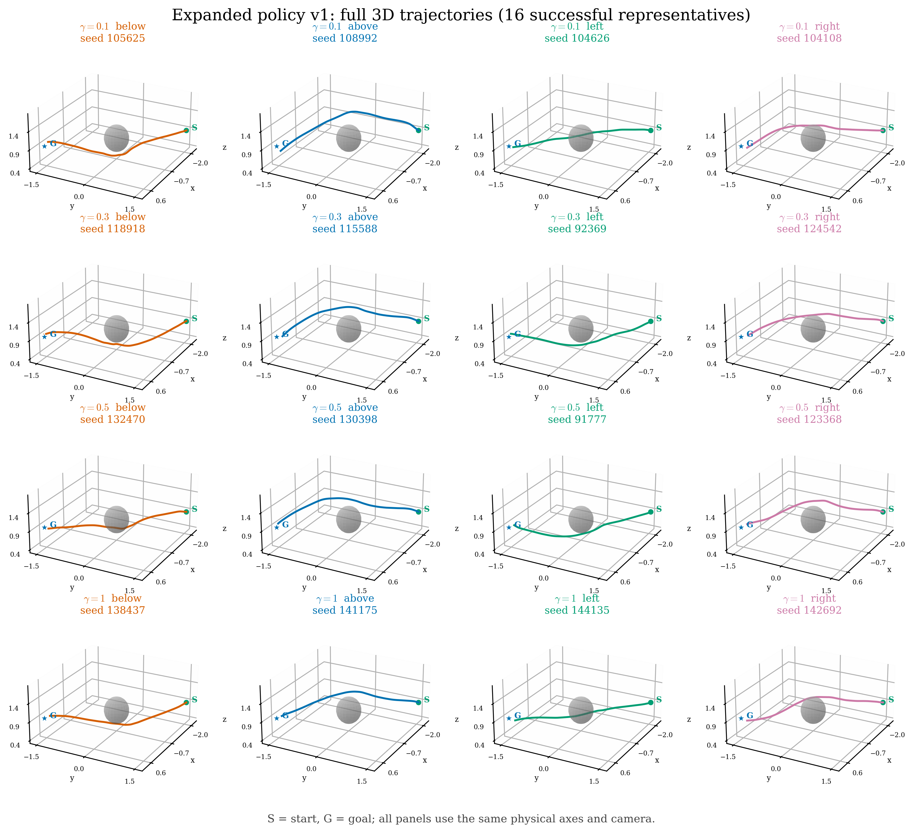
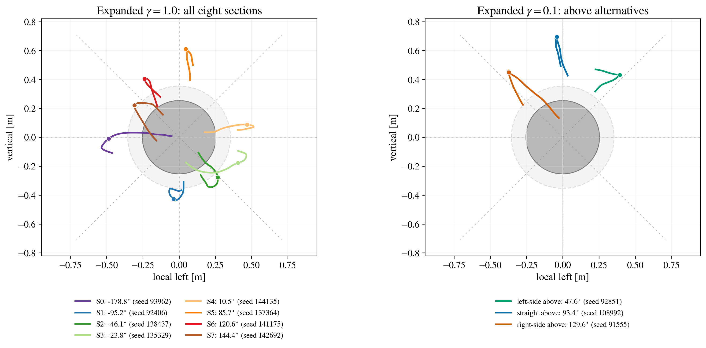
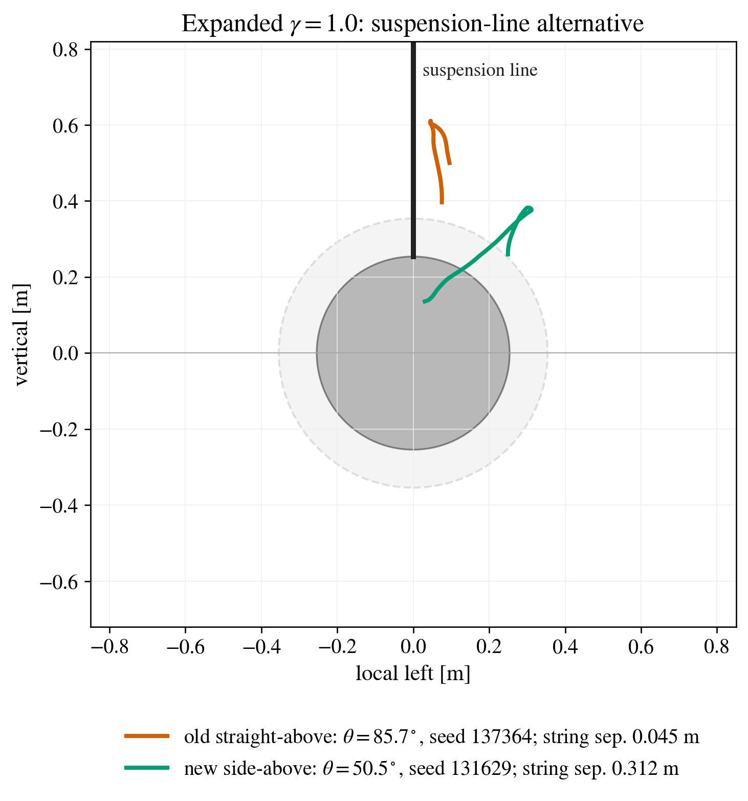
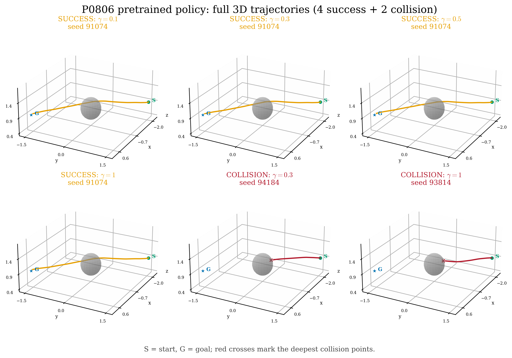
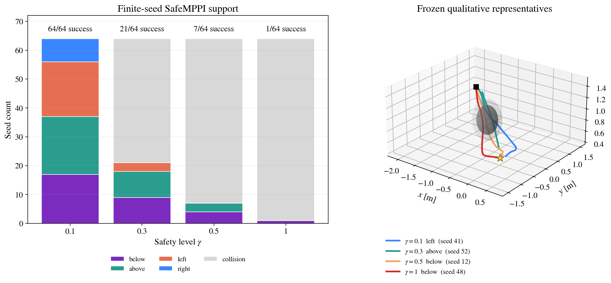

# 0808 single-sphere OOD coverage handoff

This directory is the approved, self-contained 33-reference handoff:

- expanded policy v1: 16 successful trajectories (`4 gamma x 4 modes`)
- expanded policy v1 supplement: 4 additional gamma-1 octants and 2 gamma-0.1 side-above trajectories
- expanded policy v1 string-safe supplement: 1 gamma-1 side-above trajectory
- P0806 pretrained policy: 4 successful slight-above/left-boundary trajectories
- P0806 pretrained policy: 2 reproducible sphere-collision trajectories
- 0806 SafeMPPI: 4 successful prominent-class representatives (`1/gamma`)

The two collision trajectories are simulation-only negative controls. The
hardware player rejects them, and they must not be flown unchanged.

## Frozen model and rollout identities

| artifact | file | SHA-256 | packaged NFE |
|---|---|---|---:|
| expanded policy v1 (Reserve G) | `checkpoints/expanded_v1_reserve_G_nfe12.pt` | `c1a3c77fc956c57d02a0970c4e54fca942cee391a68275a58134361e00828056` | 12 |
| P0806 pretrained | `checkpoints/pretrained_p0806_nfe16.pt` | `cc87b65f27506254509b7f4cbbe4734aacfc9e50640a3756cfb0b1ed456e28ff` | 16 |
| canonical task config | `config/task_config_resolved.json` | `7508a7a76754270e6ffceae8ed9ba3946b5204f5a90d8542c78b55ce835444c2` | n/a |

The exact rollout runtime is bundled under `runtime_snapshot/`. Its source ID is
`5c8a57779f16-008acd883e14`; the base Git commit is
`5c8a57779f165c583b297b73ab6d8bf90e3f59f5`.

Common rollout contract:

```text
sampling temperature  1.0
governor              ReferenceGovernor, exactly once
rollout seed           episode_seed * 100000 + closed_loop_step
controller dt          0.1 s
integration substeps   10 (dense states at 0.01 s)
device                 NVIDIA H100 NVL
```

Exact array-level reproduction also binds each selection to the recorded
physical GPU index. The original expanded and collision trajectories use
physical GPU 2; the expanded supplement and pretrained successes use physical
GPU 3.

## Approved trajectories

### Expanded policy v1: quality-v2 selection

The selection is stored in `selections/expanded_quality_v2.json`; trajectory
arrays and the repeated-rollout manifest are in
`trajectories/expanded_quality_v2/`.

| gamma | below | above | left | right |
|---:|---:|---:|---:|---:|
| 0.1 | 105625 | 108992 | 104626 | 104108 |
| 0.3 | 118918 | 115588 | 92369 | 124542 |
| 0.5 | 132470 | 130398 | 91777 | 123368 |
| 1.0 | 138437 | 141175 | 144135 | 142692 |

All 16 are successful and strictly reduce Euclidean distance to the goal at
every stored 0.01 s dense integration step. The smallest progress anywhere is
`+3.8287e-06 m`. Mean minimum-clearance and time-to-goal by gamma are:

| gamma | mean min clearance | mean time-to-goal |
|---:|---:|---:|
| 0.1 | 0.21085 m | 10.075 s |
| 0.3 | 0.18531 m | 10.300 s |
| 0.5 | 0.14822 m | 9.900 s |
| 1.0 | 0.06579 m | 9.600 s |

The full per-trajectory audit is in
`quality/expanded_quality_v2_summary.json`. The 1,466 successful trajectories
screened from the 2,080-rollout support bank are preserved in
`quality/quality_search_all_successes_gpu2.json`.

### Expanded angular supplement: frozen references

The supplement is frozen under `trajectories/expanded_supplement_v1/`; its
selection contract is
`selections/expanded_gamma1_octants_and_side_above_v1.json`. These are exact
rollouts, not requests to infer or resample the policy during flight.

Together with the original four gamma-1 trajectories, the four new references
fill every 45-degree crossing section exactly once:

| section | angle range | crossing angle | seed | source |
|---:|---|---:|---:|---|
| S0 | [-180, -135) | -178.819 deg | 93962 | `expanded_supplement_v1` |
| S1 | [-135, -90) | -95.234 deg | 92406 | `expanded_supplement_v1` |
| S2 | [-90, -45) | -46.060 deg | 138437 | `expanded_quality_v2` |
| S3 | [-45, 0) | -23.766 deg | 135329 | `expanded_supplement_v1` |
| S4 | [0, 45) | 10.463 deg | 144135 | `expanded_quality_v2` |
| S5 | [45, 90) | 85.748 deg | 137364 | `expanded_supplement_v1` |
| S6 | [90, 135) | 120.564 deg | 141175 | `expanded_quality_v2` |
| S7 | [135, 180) | 144.403 deg | 142692 | `expanded_quality_v2` |

For gamma 0.1, two additional above trajectories avoid the nearly vertical
straight-over-ball route:

| role | crossing angle | seed | minimum clearance |
|---|---:|---:|---:|
| left-side above | 47.584 deg | 92851 | 0.22881 m |
| straight above (original) | 93.353 deg | 108992 | 0.31964 m |
| right-side above | 129.636 deg | 91555 | 0.21006 m |

All six new trajectories are terminal successes and strictly reduce goal
distance at every 10 Hz state knot and every stored 100 Hz dense knot. Two
fresh runs per trajectory were array-level bit-identical. The exact audit is
`quality/expanded_angular_supplement_v1_summary.json`.

#### Gamma-1 suspension-line replacement

Do not use straight-above seed `137364` when the ball is suspended from a
vertical line. Its closest horizontal approach to the line above the physical
sphere is only `0.0454 m`. The added frozen replacement is:

| gamma | seed | crossing angle | section | min. obstacle clearance | min. horizontal string separation |
|---:|---:|---:|---:|---:|---:|
| 1.0 | 131629 | 50.452 deg | S5 | 0.13528 m | 0.31159 m |

The replacement is a terminal success, has window validity `1.0`, strictly
positive goal progress at every stored state and dense knot, terminal path
efficiency `0.9996`, and repeat-2 array-level identity. It is frozen under
`trajectories/expanded_string_safe_v1/`; the exact 100 Hz reference is under
`flight_references/expanded_string_safe_v1/`. The string separation is a
geometric centerline screen, not hardware safety certification.

### P0806 pretrained successes

The selection is stored in `selections/pretrained.json`; arrays are in
`trajectories/pretrained_success/`.

All four use seed `91074` and gamma `0.1, 0.3, 0.5, 1.0`. Their first-crossing
angles are `49.915, 48.727, 47.509, 45.066 deg`. They are the intended
left/slight-above behavior, but the exact four-mode classifier labels all four
as `above` (16-sector `S10`).

### P0806 pretrained collisions

The selection is stored in `selections/pretrained_collisions.json`; arrays are
in `trajectories/pretrained_collisions/`.

| gamma | seed | status | penetration |
|---:|---:|---|---:|
| 0.3 | 94184 | COLLISION | 0.03717 m |
| 1.0 | 93814 | COLLISION | 0.03139 m |

Every approved trajectory was run twice in a fresh process on its recorded
physical GPU. States, raw controls, applied controls, and dense states were
bit-identical between repeats.

### 0806 SafeMPPI symmetry-breaking supplement

The SafeMPPI supplement is under [`safemppi/`](safemppi/). Its source tree is
identical to the 0806 source commit
`9cafc00551e4964b9dbe559b1a4ba95104e9c88a`.

A fixed `M=64/gamma` seed bank found successful route counts of `64, 21, 7,
1` as gamma increased from `0.1` to `1.0`. Gamma 0.1 covered all four route
classes, while the only gamma-1.0 success was below. The four bundled
representatives are therefore a disclosed qualitative selection, not an
unbiased success-rate estimate:

| gamma | mode | seed |
|---:|---|---:|
| 0.1 | left | 41 |
| 0.3 | above | 52 |
| 0.5 | below | 12 |
| 1.0 | below | 48 |

This finite-sample symmetry breaking is the comparison point for the expanded
model's frozen `4 modes x 4 gammas` coverage. Full counts, exact selection
logic, candidate-level recorder events, and reproduction instructions are in
[`safemppi/README.md`](safemppi/README.md).

## Review figures

### Expanded Reserve G: 16 trajectories



### Expanded angular supplement: gamma-1 octants and gamma-0.1 side-above paths



### Gamma-1 side-above suspension-line replacement



### Pretrained policy: four successes and two collisions



### SafeMPPI: finite-seed support and four representatives



## Frozen 100 Hz flight playback

[`FLIGHT_INDEX_ALL.csv`](FLIGHT_INDEX_ALL.csv) is the authoritative map across
all 33 frozen reference files. The 29 policy references are under
[`flight_references/`](flight_references/); the four SafeMPPI references and
their separate manifest are under
[`safemppi/flight_references/`](safemppi/flight_references/).

The conversion does not call either model, SafeMPPI, or ReferenceGovernor. It
first verifies the stored governed recurrence and then exports:

```text
time_s, position_ref, velocity_ref, acceleration_ref
```

The maximum reconstruction error over the 29 policy references is
`2.39e-7 m`. Maximum speed, vertical speed, and applied acceleration are
`0.7000002 m/s`, `0.288648 m/s`, and `0.292304 m/s^2`, respectively.
The four SafeMPPI references independently pass the same governed-recurrence,
100 Hz, speed, vertical-speed, and acceleration-cap checks.

Expanded-model blind spot: the `below/above/left/right` names select frozen
seeds; they are not inputs to Reserve G. Normal flight therefore plays the
chosen reference and does not run the NFE-12 checkpoint online. The governor,
smoothing, clipping, and interpolation must not be applied again.

Operator boundaries are in [`minhyuk/README.md`](minhyuk/README.md) and
[`claude/README.md`](claude/README.md). Minhyuk and Claude write only under
their own `runs/<run_id>/` directories.

## Directory map

```text
checkpoints/       exact NFE-12 expanded and NFE-16 pretrained checkpoints
config/            resolved canonical single-sphere task
selections/        seeds, gamma/mode labels, expected first-crossing angles
trajectories/      authoritative 16 + 6 + 1 expanded / 4 + 2 pretrained NPZ files
flight_references/  verified 100 Hz references and authoritative flight index
figures/           approved 3D and head-on PNG/PDF galleries
quality/           full search rows and strict progress/smoothness audit
runtime_snapshot/  exact safe_mppi runtime used on Helios
source/            exporters, validators, search, plotting, integrity checker
safemppi/          0806-source screen, four recordings, events and 100 Hz refs
minhyuk/            flight-operator contract and validation-only player
claude/             append-only analysis contract
```

## Reproduce on Helios

The recorded environment is Python 3.11.15, NumPy 2.4.6, PyTorch
2.6.0+cu124, CUDA 12.4, cuDNN 9.1, NVIDIA H100 NVL. Full details are in
`environment.json`.

Choose a new output directory that does not already exist:

```bash
cd paper_ready/0808
bash REPRODUCE.sh /data3/research1/safeMPPI_remote_cli/reproductions/0808_33_reference_bundle
```

The script regenerates 16 original expanded successes on physical GPU 2, six
angular supplemental successes and one string-safe success on physical GPU 3,
four pretrained successes on physical GPU 3, and two pretrained collisions on physical GPU 2. It
requires two bit-identical runs for each policy trajectory, then reruns both
expanded validators and all galleries.

The SafeMPPI supplement has a separate deterministic reproduction entrypoint:

```bash
cd paper_ready/0808/safemppi
bash REPRODUCE.sh /data3/research1/safeMPPI_remote_cli/reproductions/0808_safemppi mps
```

If the machine exposes different physical GPU numbering, edit only the three
`CUDA_VISIBLE_DEVICES`/`--physical-gpu` pairs in `REPRODUCE.sh` and the matching
selection JSON fields. Such a run is a functional reproduction, not a claim of
bit-identical equality with the frozen reference arrays.

## Verify the frozen bundle

```bash
cd paper_ready/0808
python source/bundle_integrity.py

PYTHONPATH=runtime_snapshot python source/validate_expanded_quality_selection.py \
  --trajectories trajectories/expanded_quality_v2 \
  --config config/task_config_resolved.json \
  --output /tmp/expanded_quality_v2_summary.json

python source/validate_expanded_angular_supplement.py \
  --bundle . \
  --output /tmp/expanded_angular_supplement_v1_summary.json
```

`SHA256SUMS` covers every file in this directory except itself. No commit or
push is performed by the reproduction or integrity scripts.
